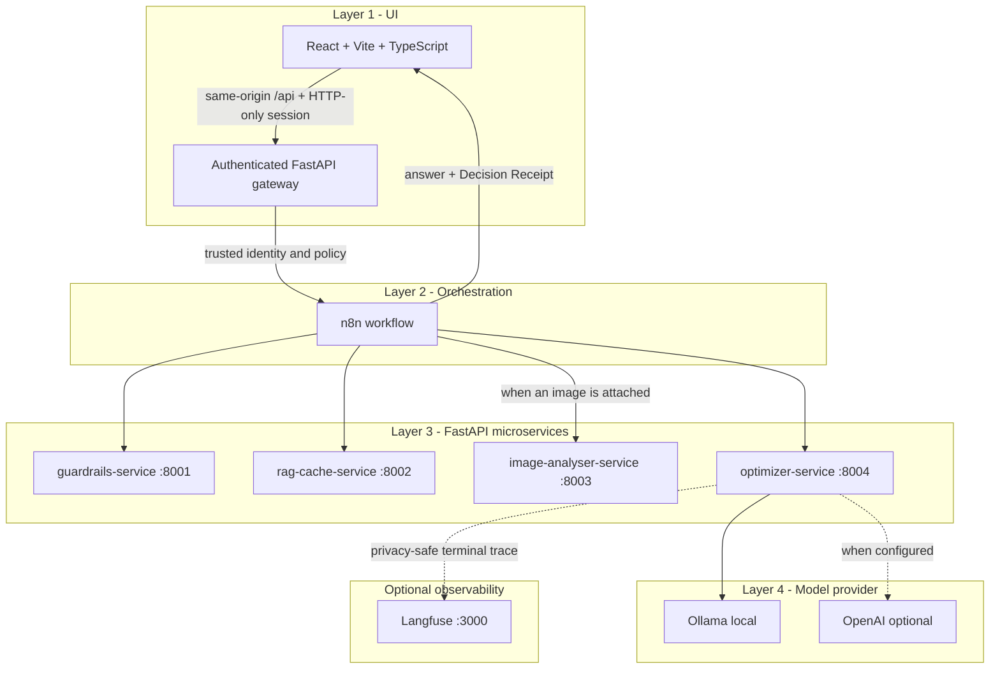

# MomiHelm

**Real-Time LLM Cost Optimization Gateway.**

MomiHelm is a middleware layer that sits between applications/users and LLM
providers. Every AI request passes through MomiHelm, which optimizes it before
it reaches a model (guardrails, semantic cache, dynamic routing, compression),
then reports the savings.

> **Status:** four-layer end-to-end path is working. **Guardrails (Day 3)**,
> **semantic cache (Day 4)**, **LangGraph optimizer (Day 5)**, **Layer 4
> provider execution (Day 6)**, **usage DB + Dashboard metrics (Day 7)**,
> **PyTorch image analysis (Day 8)**, and **privacy-safe Langfuse tracing (Day 9)**
> are now real. **Day 12 release readiness** adds automatic workflow bootstrap,
> health-based startup, loopback-only networking, production frontend serving,
> and a product-level smoke test. The current security release adds first-run
> owner setup, account sign-in, HTTP-only sessions, organization roles,
> server-enforced policy, organization/user data isolation, and private backend
> networking.

> **Brand migration:** MomiHelm is the product name. Existing lowercase
> `tokenwise` webhook paths, database filenames, Docker resources, environment
> variables, and repository paths remain unchanged for backward compatibility.

## Architecture (four layers)



See [docs/architecture.md](docs/architecture.md) for details and
[contracts/api-contracts.md](contracts/api-contracts.md) for the API shapes.

## Policy Intelligence

MomiHelm **Policy Intelligence** separates a deterministic **Structured Policy Engine**
(source of truth for enforcement) from a non-authoritative **Policy Evidence Retrieval**
layer (RAG over policy documents, used for explanation and audit only). Today only a
minimal structured form exists: `policy_mode` (`conservative`/`balanced`/`aggressive`) is a
config enum that drives compression and tier selection. `POST /policy/query` is a
placeholder (returns `{"policies": []}`) and is not wired into the flow — **Policy RAG is
not implemented**. The product model (hierarchy, presets, Policy Center, effective-policy
preview, document ingestion + approval, MVP scope, and commercial roadmap) is specified in
[docs/policy-intelligence-design.md](docs/policy-intelligence-design.md).

## Repository layout

```
tokenwise/
  docker-compose.yml          # core application stack
  docker-compose.langfuse.yml # optional self-hosted Langfuse override
  .env.example                # local ports and provider configuration
  .env.langfuse.example       # placeholder-only Langfuse configuration
  momihelm / momihelm.ps1     # lifecycle commands for macOS/Linux and Windows
  README.md
  docs/architecture.md        # diagrams + what is real vs mocked
  docs/langfuse-observability.md # Day 9 setup, privacy, and operations
  contracts/api-contracts.md  # API contracts (v0)
    services/
    gateway-service/          # FastAPI: auth, sessions, roles, policy, protected proxy
    guardrails-service/       # FastAPI: /health /check/input /check/output
    rag-cache-service/        # FastAPI: /health /cache/lookup /cache/store /policy/query
    image-analyser-service/   # FastAPI: /health /analyse
    optimizer-service/        # FastAPI: /agent/run /providers/* /usage/* /observability/*
  n8n/
    tokenwise-skeleton.workflow.json  # automatically imported and published
    bootstrap.sh                      # idempotent one-shot workflow bootstrap
    README.md                          # n8n operations and recovery
  frontend/                   # React + TypeScript build served by Nginx
  scripts/smoke_test.py       # product-level release smoke test
```

## Prerequisites

- Docker Desktop, installed and running.
- Git, to clone the repository.
- One model provider:
  - Ollama installed locally (recommended for the academic MVP), or
  - OpenAI enabled and configured in `.env`.
- Approximately 9 GB free for a first local installation. The core images use
  roughly 4 GB and `llama3.1:latest` is approximately 4.6 GB.

Node.js and Python are not required on the host for the Docker path.

## Quick start

### macOS / Linux

```bash
git clone https://github.com/tomeryoel/tokenwise.git
cd tokenwise
./momihelm doctor
./momihelm start
```

### Windows PowerShell

```powershell
git clone https://github.com/tomeryoel/tokenwise.git
Set-Location tokenwise
.\momihelm.ps1 doctor
.\momihelm.ps1 start
```

`doctor` creates an ignored local `.env` from `.env.example`, then validates
Docker, Compose, the selected provider, the Ollama model, and the Compose
configuration. `start` can pull a missing Ollama model after warning about the
download size. It then:

1. builds the committed source,
2. imports and publishes both n8n workflows automatically,
3. starts services in health-checked dependency order,
4. waits for the production frontend, and
5. opens MomiHelm at http://127.0.0.1:5173.

On first launch, MomiHelm asks you to create the organization owner account.
After that, every Playground, Dashboard, and Admin request requires an
HTTP-only session cookie. Owners can create member and admin accounts from
Admin. Members receive user-scoped Dashboard data; owners and admins receive
organization-scoped data. Every user can change their own password from
**Account**; doing so revokes their other active sessions.

Only the frontend is published to the host at `127.0.0.1:5173`. n8n, the
gateway, and all four Python services are private inside the Docker network.
For HTTPS deployment, set `MOMIHELM_COOKIE_SECURE=true` and configure the exact
public origin in `MOMIHELM_ALLOWED_ORIGINS`.

### Lifecycle commands

| Action | macOS / Linux | Windows PowerShell |
|---|---|---|
| Diagnose setup | `./momihelm doctor` | `.\momihelm.ps1 doctor` |
| Start | `./momihelm start` | `.\momihelm.ps1 start` |
| Status | `./momihelm status` | `.\momihelm.ps1 status` |
| Follow logs | `./momihelm logs` | `.\momihelm.ps1 logs` |
| Release smoke test | `./momihelm smoke` | `.\momihelm.ps1 smoke` |
| Stop, preserve data | `./momihelm stop` | `.\momihelm.ps1 stop` |

The running stack exposes:

| Component | URL |
|---|---|
| MomiHelm UI and authenticated API | http://127.0.0.1:5173 |

Backend health and webhook endpoints are intentionally not host-accessible.
Use `docker compose exec <service> ...` for diagnostics. For advanced use,
`docker compose up -d --build` still works directly; the
`n8n-init` one-shot service performs workflow import and publication. The
lifecycle commands are recommended because they also validate the provider and
wait for readiness.

## Add Langfuse observability (Day 9, optional)

The core command above remains lightweight. To add the self-hosted Langfuse stack,
create an ignored local environment file from the placeholder-only example, replace
every `CHANGE_ME` value, and start both Compose files:

```powershell
Copy-Item .env.langfuse.example .env.langfuse
docker compose --env-file .env.langfuse -f docker-compose.yml -f docker-compose.langfuse.yml up -d --build
```

macOS/Linux equivalent:

```bash
cp .env.langfuse.example .env.langfuse
docker compose --env-file .env.langfuse -f docker-compose.yml -f docker-compose.langfuse.yml up -d --build
```

This additionally starts Langfuse Web at http://localhost:3000 and its official
self-hosted dependencies. Verify it with
`GET http://localhost:3000/api/public/health`, then inspect MomiHelm export state at
`GET http://optimizer-service:8000/observability/status` from inside the Compose
network. Full setup, privacy guarantees,
trace stages, and troubleshooting are in
[docs/langfuse-observability.md](docs/langfuse-observability.md).

## Test it

### 1. Automated release smoke test

```bash
./momihelm smoke
```

```powershell
.\momihelm.ps1 smoke
```

The smoke test verifies the provider-error contract, new text execution,
semantic cache reuse, PII redaction/local routing, prompt-injection blocking,
low-complexity image handling, and usage analytics.

### 2. Health checks

```bash
docker compose ps
curl -fsS http://127.0.0.1:5173/healthz
```

Compose reports the internal services as healthy without publishing their ports.

### 3. From the UI

Open http://127.0.0.1:5173, create the first owner account or sign in, type a
prompt in **Playground**, click **Run with MomiHelm**, and read the answer plus
Decision Receipt. Owners and admins set the server-enforced organization policy
in **Admin**.

> Workflow import and publication are automatic. If a service or provider fails,
> the UI reports the real pipeline outcome and never invents a mock answer.

## Semantic cache (Day 4)

The `rag-cache-service` is a **real** semantic cache:

- Embeddings: `sentence-transformers/all-MiniLM-L6-v2` (CPU only).
- Store: ChromaDB persistent client at `/app/data/chroma` on the `rag_cache_data`
  volume; the HF model is cached at `/app/data/hf` on the same volume so it is not
  re-downloaded on every restart. **Cache entries survive container restarts.**
- Similarity: cosine, `confidence = clamp(1 - cosine_distance, 0, 1)`; default
  threshold `0.88` (env `CACHE_SIMILARITY_THRESHOLD`, overridable per request).
- Tenant isolation: lookups require both trusted `organization_id` and `dept_id`
  metadata. Legacy direct calls use the isolated `legacy-local` organization.
- Sensitive requests (`contains_sensitive_data=true`, e.g. PII) are never searched
  or stored.

On a cache hit, n8n **skips the optimizer and model provider**, runs the cached answer
through the output guardrail, and returns it with `savings_source=semantic_cache`.
On a miss, the model path runs and the safe final answer is stored (best-effort).

> First lookup/store after a cold start downloads the MiniLM model (~90 MB) into
> the volume; subsequent restarts reuse it.

## Optimizer LangGraph (Day 5)

The `optimizer-service` is a real, deterministic, **conditional** **LangGraph**
state graph (`services/optimizer-service/graph.py`). A router
(`route_request_path`) uses conditional edges to pick one of five paths -
`reject_path`, `cache_path`, `local_only_path`, `vision_path`,
`standard_optimization_path` - and the standard path has a second conditional edge
(`should_recommend_compression`) that runs the compression node only when needed.
All paths converge into cost estimation + final plan.

It returns a structured Optimization Plan (routing tier, compression
recommendation, fallback plan, cost/savings estimate, decision reasons) plus graph
observability (`graph_path`, `branch_reason`, `executed_nodes`). Policy modes
(`conservative`/`balanced`/`aggressive`) can produce different plans for the same
prompt. See [docs/architecture.md](docs/architecture.md) for the graph diagram and
the command to print the compiled graph as Mermaid.

Run the optimizer unit tests without Docker/n8n:

```powershell
cd services/optimizer-service
pip install -r requirements.txt pytest
python -m pytest -q
```

## Layer 4 model execution (Day 6)

The optimizer-service now executes real models via `POST /providers/execute`.
Provider adapters live in `services/optimizer-service/providers/` as an MVP
packaging decision (four-service architecture preserved).

- **Ollama (local):** `POST {OLLAMA_BASE_URL}/api/chat` with `stream=false`.
  Default model: `llama3.1:latest` (detected on host). Docker uses
  `http://host.docker.internal:11434` via `extra_hosts`.
- **OpenAI (optional):** Responses API, enabled only when
  `ENABLE_OPENAI_PROVIDER=true` and `OPENAI_API_KEY` is set. Disabled safely
  when not configured.
- **Never commit API keys.** Use the root `.env` copied from `.env.example`;
  `.env` is gitignored.

Provider health is available internally at
`http://optimizer-service:8000/providers/health`.

## Usage database, cost avoidance, and ROI (Days 7 and 10)

The optimizer-service persists terminal request outcomes in SQLite at
`/app/data/usage/tokenwise.db` (Docker volume `usage_data`).

- `POST /usage/log` — idempotent request logging (n8n calls on every terminal path)
- `GET /usage/summary` — aggregated metrics for the Dashboard; accepts optional
  positive `operating_cost_usd` for an explicit ROI scenario
- `GET /usage/recent` — privacy-safe recent request list (no prompts)

Dashboard fetches analytics through the authenticated same-origin gateway. The
gateway injects `organization_id`; member requests also receive a mandatory
`user_id` filter.

**Primary cost-avoidance metric:** `actual_cost_saved` when known, else
`estimated_savings` (one value per request, never double-counted). The response
reports actual and estimated coverage counts and keeps `total_savings` as a
backward-compatible alias for `total_modeled_cost_avoidance`.

**ROI:** without `operating_cost_usd`, ROI remains `null` with
`roi_status: operating_cost_not_modeled`. When a positive scenario cost is
supplied, ROI is `(modeled cost avoidance - operating cost) / operating cost`.
This keeps the scenario assumption explicit and avoids presenting local API cost
as total operating cost.

Policy-mode request counts and cost avoidance are reported separately for
`conservative`, `balanced`, and `aggressive`. `premium_usage_rate` counts actual
premium executions; `premium_requested_rate` reports premium requests.

**Privacy:** only SHA-256 prompt fingerprints are stored in usage SQLite; no raw
prompts, PII, or secrets. n8n is configured not to retain new successful, failed,
or manual execution payloads. Existing local execution history is preserved
until its owner explicitly approves deletion.

Development reset (optional): `python -m usage.reset_db --force`

## Langfuse observability (Day 9)

Every terminal n8n path already calls `POST /usage/log`. After SQLite persistence,
the optimizer-service exports one deterministic Langfuse trace for that `request_id`.
The trace contains only structured routing, guardrail, cache, provider, token, cost,
latency, and savings facts. Raw prompts and generated answers are never exported.

- Tracing is opt-in through `docker-compose.langfuse.yml` and `.env.langfuse`.
- Export is idempotent per `request_id`; failures are recorded and retried on a later call.
- Observability is fail-open: SQLite logging and the user response still succeed if
  Langfuse is unavailable.
- `GET /observability/status` reports configuration and aggregate export state.
- `GET /observability/traces/{request_id}` reports the trace ID, URL, attempts, and
  last error without exposing credentials or prompt content.

The exporter and its tests live under
`services/optimizer-service/observability/` and
`services/optimizer-service/test_observability.py`.

## Offline AI evaluation (Ragas)

MomiHelm uses **[Ragas](https://docs.ragas.io) `0.4.3`** as an **offline**
evaluation layer (lecturer requirement). It runs **real** Ragas metrics on
**real** generated responses and saves reviewable artifacts. It is **not** in the
real-time request path — Playground users never wait for Ragas.

It compares an **un-optimized direct baseline** (Ollama, bypassing MomiHelm)
against the **real MomiHelm n8n pipeline**, measuring whether MomiHelm reduces
modeled cost / tokens / unnecessary model calls while preserving answer quality.

- Judge: local Ollama `llama3.1:latest` (via the OpenAI-compatible endpoint).
- Embeddings: local `sentence-transformers/all-MiniLM-L6-v2`.
- Metrics: Semantic Similarity, Response Relevancy, Factual Correctness, and a
  custom MomiHelm grounding rubric; plus the derived `quality_preservation_ratio`.
- Ragas is **not** RAG, **not** the semantic cache, **not** Langfuse, and **not**
  the usage dashboard.

```powershell
# from repo root, with the MomiHelm stack up and Ollama running
evaluation\.venv\Scripts\python.exe -m evaluation.ragas_eval.run_evaluation --env-check
evaluation\.venv\Scripts\python.exe -m evaluation.ragas_eval.run_evaluation --mode smoke
evaluation\.venv\Scripts\python.exe -m evaluation.ragas_eval.run_evaluation --mode full
```

See [evaluation/README.md](evaluation/README.md) for setup and
[docs/evaluation/ragas-evaluation-report.md](docs/evaluation/ragas-evaluation-report.md)
for the canonical reviewed report.

## What is still mocked

- Prompt compression is recommended only (not executed).
- Vision-tier multimodal model execution (classification runs locally; provider
  vision tier is not executed - every attachment returns structured, honest
  local analysis and never falls through to a text model that cannot see it).
- Policy Intelligence runtime (Policy Center, Policy Evidence Retrieval,
  inheritance) is **documentation only** — `POST /policy/query` remains a
  placeholder returning `{"policies": []}`. See
  [docs/policy-intelligence-design.md](docs/policy-intelligence-design.md).

Real: guardrails (Day 3), semantic cache (Day 4), LangGraph optimizer (Day 5),
Layer 4 provider execution (Day 6), usage DB + Dashboard (Day 7),
PyTorch image analyser + Playground upload (Day 8), privacy-safe Langfuse tracing
(Day 9), offline Ragas evaluation, MomiHelm product-answer grounding.

## Frontend without Docker (optional)

```powershell
cd frontend
npm ci
Copy-Item .env.example .env
npm run dev
```
