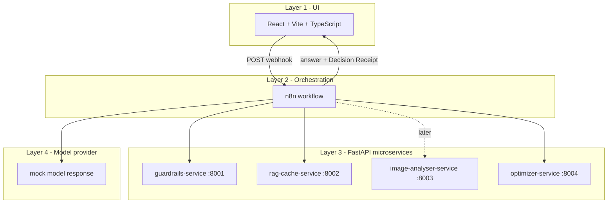

# TokenWise

**Real-Time LLM Cost Optimization Gateway.**

TokenWise is a middleware layer that sits between applications/users and LLM
providers. Every AI request passes through TokenWise, which optimizes it before
it reaches a model (guardrails, semantic cache, dynamic routing, compression),
then reports the savings.

> **Status:** four-layer end-to-end path is working. **Guardrails (Day 3)** and the
> **semantic cache (Day 4)** are now real. LangGraph decisions, PyTorch training,
> Langfuse tracing and external LLM calls are still mocked / added in later phases.

## Architecture (four layers)



See [docs/architecture.md](docs/architecture.md) for details and
[contracts/api-contracts.md](contracts/api-contracts.md) for the API shapes.

## Repository layout

```
tokenwise/
  docker-compose.yml          # runs everything
  README.md
  docs/architecture.md        # diagrams + what is real vs mocked
  contracts/api-contracts.md  # API contracts (v0)
  services/
    guardrails-service/       # FastAPI: /health /check/input /check/output
    rag-cache-service/        # FastAPI: /health /cache/lookup /cache/store /policy/query
    image-analyser-service/   # FastAPI: /health /analyse
    optimizer-service/        # FastAPI: /health /agent/run
  n8n/
    tokenwise-skeleton.workflow.json  # import into n8n
    README.md                          # n8n setup instructions
  frontend/                   # React + Vite + TypeScript (Playground/Dashboard/Admin)
```

## Prerequisites (Windows)

- Docker Desktop (running)
- That's it for the docker path. (Node.js only needed if you run the frontend
  outside Docker.)

## Run everything (PowerShell)

From the repository root:

```powershell
docker compose up --build
```

This starts:

| Component | URL |
|---|---|
| React UI | http://localhost:5173 |
| n8n | http://localhost:5679 |
| guardrails-service | http://localhost:8001/health |
| rag-cache-service | http://localhost:8002/health |
| image-analyser-service | http://localhost:8003/health |
| optimizer-service | http://localhost:8004/health |

Then import + activate the n8n workflow (one-time) as described in
[n8n/README.md](n8n/README.md).

## Test it

### 1. Health checks (PowerShell)

```powershell
Invoke-RestMethod http://localhost:8001/health
Invoke-RestMethod http://localhost:8002/health
Invoke-RestMethod http://localhost:8003/health
Invoke-RestMethod http://localhost:8004/health
```

Each returns `{"status":"ok","service":"..."}`.

### 2. End-to-end through n8n (PowerShell)

```powershell
$body = @{ prompt = "How do I reset my password?"; policy_mode = "balanced" } | ConvertTo-Json
Invoke-RestMethod -Uri "http://localhost:5679/webhook/tokenwise" -Method Post -Body $body -ContentType "application/json"
```

> Note: n8n is published on host port **5679** (not the default 5678) so it does
> not collide with any other n8n you may already run on this machine. Inside the
> compose network n8n still listens on 5678.

Returns `{ answer, receipt }` where `receipt` contains `guardrail_status`,
`cache_status`, `selected_tier`, `estimated_tokens`, `estimated_cost`,
`optimization_reason`, `cost_saved`.

### 3. From the UI

Open http://localhost:5173, type a prompt in **Playground**, pick a policy mode,
click **Run with TokenWise**, and read the answer + Decision Receipt.

> If the n8n workflow is not imported/active yet, the UI shows a clearly-labelled
> "temporary local mock" banner so it is still demonstrable. Import + activate the
> workflow to exercise the real Layer 2 -> Layer 3 path.

## Semantic cache (Day 4)

The `rag-cache-service` is a **real** semantic cache:

- Embeddings: `sentence-transformers/all-MiniLM-L6-v2` (CPU only).
- Store: ChromaDB persistent client at `/app/data/chroma` on the `rag_cache_data`
  volume; the HF model is cached at `/app/data/hf` on the same volume so it is not
  re-downloaded on every restart. **Cache entries survive container restarts.**
- Similarity: cosine, `confidence = clamp(1 - cosine_distance, 0, 1)`; default
  threshold `0.88` (env `CACHE_SIMILARITY_THRESHOLD`, overridable per request).
- Department isolation: lookups filter by `dept_id` metadata (default `demo-support`).
- Sensitive requests (`contains_sensitive_data=true`, e.g. PII) are never searched
  or stored.

On a cache hit, n8n **skips the optimizer and mock model**, runs the cached answer
through the output guardrail, and returns it with `savings_source=semantic_cache`.
On a miss, the model path runs and the safe final answer is stored (best-effort).

> First lookup/store after a cold start downloads the MiniLM model (~90 MB) into
> the volume; subsequent restarts reuse it.

## What is still mocked

- Optimizer returns a static-ish plan (numbers derived from prompt length); no
  LangGraph decisions yet.
- Image analyser returns a fixed class; not wired into the flow yet.
- Model answer is a fixed mock string; no Ollama/external LLM yet.
- Dashboard shows mock metrics; no usage DB yet.
- Langfuse is a commented placeholder in docker-compose.

Real: guardrails (Day 3) and semantic cache (Day 4).

## Frontend without Docker (optional)

```powershell
cd frontend
npm install
Copy-Item .env.example .env
npm run dev
```
