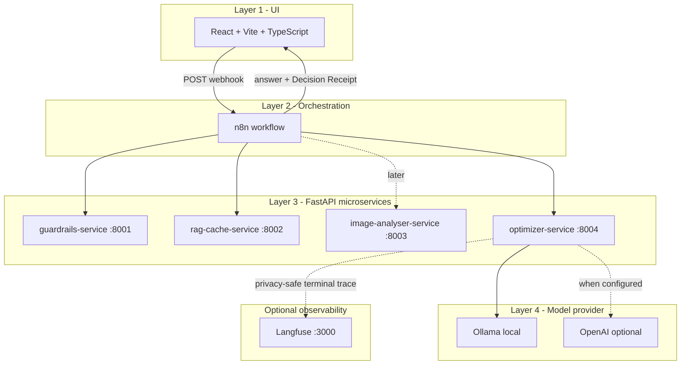

# TokenWise

**Real-Time LLM Cost Optimization Gateway.**

TokenWise is a middleware layer that sits between applications/users and LLM
providers. Every AI request passes through TokenWise, which optimizes it before
it reaches a model (guardrails, semantic cache, dynamic routing, compression),
then reports the savings.

> **Status:** four-layer end-to-end path is working. **Guardrails (Day 3)**,
> **semantic cache (Day 4)**, **LangGraph optimizer (Day 5)**, **Layer 4
> provider execution (Day 6)**, **usage DB + Dashboard metrics (Day 7)**,
> **PyTorch image analysis (Day 8)**, and **privacy-safe Langfuse tracing (Day 9)**
> are now real.

## Architecture (four layers)



See [docs/architecture.md](docs/architecture.md) for details and
[contracts/api-contracts.md](contracts/api-contracts.md) for the API shapes.

## Policy Intelligence

TokenWise **Policy Intelligence** separates a deterministic **Structured Policy Engine**
(source of truth for enforcement) from a non-authoritative **Policy Evidence Retrieval**
layer (RAG over policy documents, used for explanation and audit only). Today only a
minimal structured form exists: `policy_mode` (`conservative`/`balanced`/`aggressive`) is a
config enum that drives compression and tier selection. `POST /policy/query` is a
placeholder (returns `{"policies": []}`) and is not wired into the flow — **Policy RAG is
not implemented**. The product model (hierarchy, presets, Policy Center, effective-policy
preview, document ingestion + approval, MVP scope, and commercial roadmap) is specified in
[docs/policy-intelligence-design.md](docs/policy-intelligence-design.md).

## Repository layout

```
tokenwise/
  docker-compose.yml          # core application stack
  docker-compose.langfuse.yml # optional self-hosted Langfuse override
  .env.langfuse.example       # placeholder-only Langfuse configuration
  README.md
  docs/architecture.md        # diagrams + what is real vs mocked
  docs/langfuse-observability.md # Day 9 setup, privacy, and operations
  contracts/api-contracts.md  # API contracts (v0)
  services/
    guardrails-service/       # FastAPI: /health /check/input /check/output
    rag-cache-service/        # FastAPI: /health /cache/lookup /cache/store /policy/query
    image-analyser-service/   # FastAPI: /health /analyse
    optimizer-service/        # FastAPI: /agent/run /providers/* /usage/* /observability/*
  n8n/
    tokenwise-skeleton.workflow.json  # import into n8n
    README.md                          # n8n setup instructions
  frontend/                   # React + Vite + TypeScript (Playground/Dashboard/Admin)
```

## Prerequisites (Windows)

- Docker Desktop (running)
- That's it for the docker path. (Node.js only needed if you run the frontend
  outside Docker.)

## Run the core stack (PowerShell)

From the repository root:

```powershell
docker compose up --build
```

This starts:

| Component | URL |
|---|---|
| React UI | http://localhost:5173 |
| n8n | http://localhost:5679 |
| guardrails-service | http://localhost:8001/health |
| rag-cache-service | http://localhost:8002/health |
| image-analyser-service | http://localhost:8003/health |
| optimizer-service | http://localhost:8004/health |

Then import + activate the n8n workflow (one-time) as described in
[n8n/README.md](n8n/README.md).

## Add Langfuse observability (Day 9, optional)

The core command above remains lightweight. To add the self-hosted Langfuse stack,
create an ignored local environment file from the placeholder-only example, replace
every `CHANGE_ME` value, and start both Compose files:

```powershell
Copy-Item .env.langfuse.example .env.langfuse
docker compose --env-file .env.langfuse -f docker-compose.yml -f docker-compose.langfuse.yml up -d --build
```

macOS/Linux equivalent:

```bash
cp .env.langfuse.example .env.langfuse
docker compose --env-file .env.langfuse -f docker-compose.yml -f docker-compose.langfuse.yml up -d --build
```

This additionally starts Langfuse Web at http://localhost:3000 and its official
self-hosted dependencies. Verify it with
`GET http://localhost:3000/api/public/health`, then inspect TokenWise export state at
`GET http://localhost:8004/observability/status`. Full setup, privacy guarantees,
trace stages, and troubleshooting are in
[docs/langfuse-observability.md](docs/langfuse-observability.md).

## Test it

### 1. Health checks (PowerShell)

```powershell
Invoke-RestMethod http://localhost:8001/health
Invoke-RestMethod http://localhost:8002/health
Invoke-RestMethod http://localhost:8003/health
Invoke-RestMethod http://localhost:8004/health
```

Each returns `{"status":"ok","service":"..."}`.

### 2. End-to-end through n8n (PowerShell)

```powershell
$body = @{ prompt = "How do I reset my password?"; policy_mode = "balanced" } | ConvertTo-Json
Invoke-RestMethod -Uri "http://localhost:5679/webhook/tokenwise" -Method Post -Body $body -ContentType "application/json"
```

> Note: n8n is published on host port **5679** (not the default 5678) so it does
> not collide with any other n8n you may already run on this machine. Inside the
> compose network n8n still listens on 5678.

Returns `{ answer, receipt }` where `receipt` contains `guardrail_status`,
`cache_status`, `selected_tier`, `estimated_tokens`, `estimated_cost`,
`optimization_reason`, `cost_saved`.

### 3. From the UI

Open http://localhost:5173, type a prompt in **Playground**, pick a policy mode,
click **Run with TokenWise**, and read the answer + Decision Receipt.

> If the n8n workflow is not imported/active yet, the UI shows a clearly-labelled
> "temporary local mock" banner so it is still demonstrable. Import + activate the
> workflow to exercise the real Layer 2 -> Layer 3 path.

## Semantic cache (Day 4)

The `rag-cache-service` is a **real** semantic cache:

- Embeddings: `sentence-transformers/all-MiniLM-L6-v2` (CPU only).
- Store: ChromaDB persistent client at `/app/data/chroma` on the `rag_cache_data`
  volume; the HF model is cached at `/app/data/hf` on the same volume so it is not
  re-downloaded on every restart. **Cache entries survive container restarts.**
- Similarity: cosine, `confidence = clamp(1 - cosine_distance, 0, 1)`; default
  threshold `0.88` (env `CACHE_SIMILARITY_THRESHOLD`, overridable per request).
- Department isolation: lookups filter by `dept_id` metadata (default `demo-support`).
- Sensitive requests (`contains_sensitive_data=true`, e.g. PII) are never searched
  or stored.

On a cache hit, n8n **skips the optimizer and mock model**, runs the cached answer
through the output guardrail, and returns it with `savings_source=semantic_cache`.
On a miss, the model path runs and the safe final answer is stored (best-effort).

> First lookup/store after a cold start downloads the MiniLM model (~90 MB) into
> the volume; subsequent restarts reuse it.

## Optimizer LangGraph (Day 5)

The `optimizer-service` is a real, deterministic, **conditional** **LangGraph**
state graph (`services/optimizer-service/graph.py`). A router
(`route_request_path`) uses conditional edges to pick one of five paths -
`reject_path`, `cache_path`, `local_only_path`, `vision_path`,
`standard_optimization_path` - and the standard path has a second conditional edge
(`should_recommend_compression`) that runs the compression node only when needed.
All paths converge into cost estimation + final plan.

It returns a structured Optimization Plan (routing tier, compression
recommendation, fallback plan, cost/savings estimate, decision reasons) plus graph
observability (`graph_path`, `branch_reason`, `executed_nodes`). Policy modes
(`conservative`/`balanced`/`aggressive`) can produce different plans for the same
prompt. See [docs/architecture.md](docs/architecture.md) for the graph diagram and
the command to print the compiled graph as Mermaid.

Run the optimizer unit tests without Docker/n8n:

```powershell
cd services/optimizer-service
pip install -r requirements.txt pytest
python -m pytest -q
```

## Layer 4 model execution (Day 6)

The optimizer-service now executes real models via `POST /providers/execute`.
Provider adapters live in `services/optimizer-service/providers/` as an MVP
packaging decision (four-service architecture preserved).

- **Ollama (local):** `POST {OLLAMA_BASE_URL}/api/chat` with `stream=false`.
  Default model: `llama3.1:latest` (detected on host). Docker uses
  `http://host.docker.internal:11434` via `extra_hosts`.
- **OpenAI (optional):** Responses API, enabled only when
  `ENABLE_OPENAI_PROVIDER=true` and `OPENAI_API_KEY` is set. Disabled safely
  when not configured.
- **Never commit API keys.** Use `services/optimizer-service/.env.example` as
  a template only.

Provider health: `GET http://localhost:8004/providers/health`

## Usage database and Dashboard (Day 7)

The optimizer-service persists terminal request outcomes in SQLite at
`/app/data/usage/tokenwise.db` (Docker volume `usage_data`).

- `POST /usage/log` — idempotent request logging (n8n calls on every terminal path)
- `GET /usage/summary` — aggregated metrics for the Dashboard
- `GET /usage/recent` — privacy-safe recent request list (no prompts)

Dashboard fetches analytics via n8n read-only webhook:
`GET http://localhost:5679/webhook/tokenwise-usage-summary`

**Primary savings metric:** `actual_cost_saved` when known, else `estimated_savings`
(one value per request — never double-counted).

**ROI:** `savings_percentage` vs baseline is reported; true commercial ROI is not
claimed (`roi_status: operating_cost_not_modeled`) because TokenWise operating
cost is not yet modeled.

**Privacy:** only SHA-256 prompt fingerprints stored; no raw prompts, PII, or secrets.

Development reset (optional): `python -m usage.reset_db --force`

## Langfuse observability (Day 9)

Every terminal n8n path already calls `POST /usage/log`. After SQLite persistence,
the optimizer-service exports one deterministic Langfuse trace for that `request_id`.
The trace contains only structured routing, guardrail, cache, provider, token, cost,
latency, and savings facts. Raw prompts and generated answers are never exported.

- Tracing is opt-in through `docker-compose.langfuse.yml` and `.env.langfuse`.
- Export is idempotent per `request_id`; failures are recorded and retried on a later call.
- Observability is fail-open: SQLite logging and the user response still succeed if
  Langfuse is unavailable.
- `GET /observability/status` reports configuration and aggregate export state.
- `GET /observability/traces/{request_id}` reports the trace ID, URL, attempts, and
  last error without exposing credentials or prompt content.

The exporter and its tests live under
`services/optimizer-service/observability/` and
`services/optimizer-service/test_observability.py`.

## Offline AI evaluation (Ragas)

TokenWise uses **[Ragas](https://docs.ragas.io) `0.4.3`** as an **offline**
evaluation layer (lecturer requirement). It runs **real** Ragas metrics on
**real** generated responses and saves reviewable artifacts. It is **not** in the
real-time request path — Playground users never wait for Ragas.

It compares an **un-optimized direct baseline** (Ollama, bypassing TokenWise)
against the **real TokenWise n8n pipeline**, measuring whether TokenWise reduces
modeled cost / tokens / unnecessary model calls while preserving answer quality.

- Judge: local Ollama `llama3.1:latest` (via the OpenAI-compatible endpoint).
- Embeddings: local `sentence-transformers/all-MiniLM-L6-v2`.
- Metrics: Semantic Similarity, Response Relevancy, Factual Correctness, and a
  custom TokenWise grounding rubric; plus the derived `quality_preservation_ratio`.
- Ragas is **not** RAG, **not** the semantic cache, **not** Langfuse, and **not**
  the usage dashboard.

```powershell
# from repo root, with the TokenWise stack up and Ollama running
evaluation\.venv\Scripts\python.exe -m evaluation.ragas_eval.run_evaluation --env-check
evaluation\.venv\Scripts\python.exe -m evaluation.ragas_eval.run_evaluation --mode smoke
evaluation\.venv\Scripts\python.exe -m evaluation.ragas_eval.run_evaluation --mode full
```

See [evaluation/README.md](evaluation/README.md) for setup and
[docs/evaluation/ragas-evaluation-report.md](docs/evaluation/ragas-evaluation-report.md)
for the canonical reviewed report.

## What is still mocked

- Prompt compression is recommended only (not executed).
- Vision-tier multimodal model execution (classification runs locally; provider
  vision tier is not executed — TokenWise returns structured local analysis).
- Policy Intelligence runtime (Policy Center, Policy Evidence Retrieval,
  inheritance) is **documentation only** — `POST /policy/query` remains a
  placeholder returning `{"policies": []}`. See
  [docs/policy-intelligence-design.md](docs/policy-intelligence-design.md).

Real: guardrails (Day 3), semantic cache (Day 4), LangGraph optimizer (Day 5),
Layer 4 provider execution (Day 6), usage DB + Dashboard (Day 7),
PyTorch image analyser + Playground upload (Day 8), privacy-safe Langfuse tracing
(Day 9), offline Ragas evaluation, TokenWise product-answer grounding.

## Frontend without Docker (optional)

```powershell
cd frontend
npm install
Copy-Item .env.example .env
npm run dev
```
