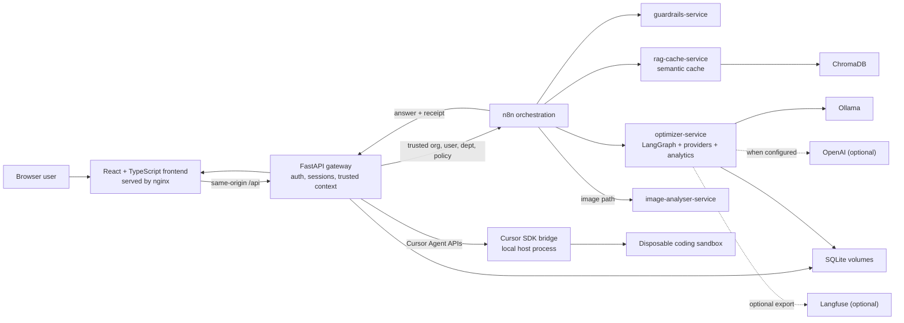

# MomiHelm

MomiHelm is a transparent AI orchestration and coding control plane that selects the right execution path for each request—and shows exactly what was recommended, selected, executed, validated, and measured.

It routes requests across local models, external providers, semantic cache, and Cursor-powered coding execution while exposing the reasoning, cost, validation, and governance signals behind each decision.

MomiHelm is the product name for this repository. The repository, webhook paths, Docker resources, and some internal filenames still use `tokenwise` for compatibility.

> Status: local end-to-end platform implemented and demoable on `main`. The default runtime is a loopback-only Docker Compose stack.

## Why MomiHelm

Teams increasingly use multiple AI models, execution paths, and coding workflows. A short factual question, a privacy-sensitive prompt, a semantic-cache hit, and a repository-editing task do not have the same cost, latency, quality, or safety requirements.

In many AI developer tools, the selected path is opaque. Teams see an answer, but not why it was routed that way, whether a cheaper local route existed, whether a coding run was validated, or what evidence remains for review.

MomiHelm addresses that gap with transparent orchestration across guardrails, cache, optimization, provider execution, and coding-agent execution, plus explicit routing stages and privacy-conscious analytics.

## Core capabilities

- **Quick question** for lightweight requests without coding-outcome tracking.
- **Coding session** for structured coding objectives with classification, verification, Model Fit, and Cost-to-Success.
- **Cursor Agent Coding Run** for local Cursor SDK execution with model selection, diff review, and validation.
- Deterministic input guardrails and output checks.
- Semantic-cache lookup and best-effort storage.
- LangGraph-based path and tier recommendation.
- Local Ollama execution by default, with optional external-provider execution when configured.
- Structured Decision Receipt and Routing Transparency for both standard requests and Cursor-based coding execution.
- Authenticated sessions using HttpOnly cookies, with role-based administrative controls.
- Metadata-oriented usage persistence and coding-session analytics.
- Privacy-conscious Langfuse export as an optional overlay.
- Release-style `doctor` and `smoke` commands for local verification.

## Architecture


```mermaid
flowchart LR
    User["Browser user"]
    Frontend["React + TypeScript frontend<br/>served by nginx"]
    Gateway["FastAPI gateway<br/>auth, sessions, trusted context"]
    N8N["n8n orchestration"]
    Guardrails["guardrails-service"]
    Cache["rag-cache-service<br/>semantic cache"]
    Optimizer["optimizer-service<br/>LangGraph + providers + analytics"]
    Image["image-analyser-service"]
    Bridge["Cursor SDK bridge<br/>local host process"]
    Ollama["Ollama"]
    OpenAI["OpenAI (optional)"]
    SQLite["SQLite volumes"]
    Chroma["ChromaDB"]
    Langfuse["Langfuse (optional)"]
    Sandbox["Disposable coding sandbox"]

    User --> Frontend
    Frontend -->|same-origin /api| Gateway
    Gateway -->|trusted org, user, dept, policy| N8N
    N8N --> Guardrails
    N8N --> Cache
    N8N --> Optimizer
    N8N -->|image path| Image
    Optimizer --> Ollama
    Optimizer -. when configured .-> OpenAI
    Cache --> Chroma
    Gateway -->|Cursor Agent APIs| Bridge
    Bridge --> Sandbox
    Gateway --> SQLite
    Optimizer --> SQLite
    Optimizer -. optional export .-> Langfuse
    N8N -->|answer + receipt| Gateway
    Gateway --> Frontend
```

| Component | Responsibility | Technology | Default host port |
|---|---|---|---|
| `frontend` | Web UI and same-origin API entrypoint | React 18, TypeScript, Vite, nginx | `5173` |
| `gateway-service` | Auth, sessions, role checks, trusted proxying, Cursor bridge proxying | FastAPI, httpx, Argon2 | not host-published |
| `n8n` | Request orchestration and workflow execution | n8n | `5679` editor only |
| `guardrails-service` | Input/output safety and cost-governance rules | FastAPI, regex/rules | not host-published |
| `rag-cache-service` | Semantic cache and placeholder policy endpoint | FastAPI, ChromaDB, sentence-transformers | not host-published |
| `image-analyser-service` | Local image-analysis path | FastAPI, PyTorch, torchvision | not host-published |
| `optimizer-service` | Routing, providers, analytics, coding intelligence, observability export | FastAPI, LangGraph, httpx, Langfuse SDK | not host-published |
| `bridges/cursor-sdk` | Local coding-run bridge | FastAPI, `cursor-sdk` | `8787` by default on host |
| `Ollama` | Local model provider | Ollama | host-managed, typically `11434` |
| `docker-compose.langfuse.yml` | Optional observability stack | Langfuse, Postgres, Redis, ClickHouse, MinIO | `3000`, `9090` |

## Request lifecycle

For a standard text request, the implemented flow is:

1. The frontend submits a signed-in request through the gateway.
2. The gateway injects trusted `organization_id`, `user_id`, `dept_id`, and `policy_mode`.
3. n8n normalizes the request and runs input guardrails.
4. Blocked requests stop there and return a blocked receipt.
5. Non-blocked text requests check the semantic cache.
6. Cache misses call the optimizer for a LangGraph route and tier recommendation.
7. Execution runs through local Ollama by default or OpenAI when configured and allowed.
8. Output guardrails, cache store, usage logging, and receipt construction complete the response.

Image requests go through the local image-analysis path and still receive receipt metadata, but they do not currently execute a multimodal LLM path.

Coding-session requests add a second layer: the objective is classified first, then attempts, verification events, and decision evaluations are attached to that session.

## Cursor Agent Coding Run

**Cursor Agent Coding Run — Execute repository tasks safely with model selection, diff review, and validation.**

This feature gives MomiHelm a coding-execution path distinct from normal prompt answering.

- Tasks execute through a **local host bridge** in `bridges/cursor-sdk`, which uses the official `cursor-sdk` package.
- The UI shows **recommended model** and **selected model** separately before the run.
- The bridge defaults to a **disposable sandbox** workspace and can be pointed at another clean Git repository only when explicitly configured.
- Dirty Git worktrees are **hard-blocked** before execution.
- Changed files, readable diffs for newly created untracked files, and validation results are returned in the result.
- Validation commands are **allowlisted**, with explicit status and deterministic timeout handling.
- Raw diffs are returned to the authenticated caller for that run, but are **not persisted by default**.
- Metadata such as fingerprints, selected/recommended/executed models, workspace kind, validation status, and changed-file paths can be persisted for later analytics.

There is no automatic mutation of the user's source repository. Cursor-generated changes remain confined to the disposable sandbox, and the current workflow does not automatically commit, push, open a PR, merge, or deploy them.


```mermaid
flowchart LR
    UI["Playground<br/>Cursor Agent Coding Run"] --> REC["Route recommendation"]
    REC --> SEL["User selects Cursor model"]
    SEL --> GW["Gateway /api/cursor-agent/run"]
    GW --> BR["Local Cursor SDK bridge"]
    BR --> SAFE["Workspace safety checks"]
    SAFE --> SDK["Cursor SDK run"]
    SDK --> DIFF["Collect changed files + diff"]
    DIFF --> VAL["Run allowlisted validation"]
    VAL --> PERSIST["Persist safe metadata"]
    PERSIST --> UI2["Result + diff + validation + routing transparency"]
```

## Decision transparency

MomiHelm distinguishes between three routing stages:

- **Recommended**: what MomiHelm advised before execution, based on heuristics and configuration available at the time.
- **Selected**: what the user or system chose to execute.
- **Executed**: what actually ran.

That distinction matters because MomiHelm can surface mismatches instead of flattening them into a single story.

### Decision Receipt

The normal request path returns a Decision Receipt that summarizes:

- guardrail outcome;
- cache status;
- route and tier;
- provider and model;
- estimated and observed token/cost fields where available;
- optimization reasons and graph path details.

### Routing Transparency

Routing Transparency renders the route as structured stages and includes:

- basis such as `heuristic` or `configured`;
- reason codes and assumptions;
- alternatives and cost-comparison context where available;
- warnings when recommended, selected, and executed stages differ.

### Model Fit

Model Fit is a **post-verification** coding-outcome score. It is not a live routing claim and it is not statistically calibrated confidence.

## Safety, privacy, and governance

### Implemented controls

- input guardrails for prompt injection, obvious secret patterns, low-value prompts, and PII handling;
- local-only routing constraints when sensitive data is detected;
- output guardrails for leaked-secret redaction and unsupported claim blocking;
- server-enforced organization policy mode: `conservative`, `balanced`, `aggressive`;
- authenticated gateway with HttpOnly session cookies and origin checks for state-changing requests;
- organization and user scoping enforced server-side;
- metadata-oriented persistence with prompt fingerprints instead of raw prompt storage in the main usage database;
- Cursor coding-run workspace safety, dirty-worktree blocking, diff bounding, and validation allowlisting;
- no automatic mutation of the user's source repository; Cursor-generated changes remain inside the disposable sandbox unless a user explicitly takes them elsewhere.

### Current governance limitations

- `policy_mode` is implemented and enforced, but the broader Structured Policy Engine described in `docs/policy-intelligence-design.md` is not fully built.
- `POST /policy/query` is currently a placeholder that returns an empty policy list.
- No learned routing, calibrated confidence model, or evidence-driven organizational policy hierarchy is active in the live runtime.

## Technology stack

| Layer | Verified technology |
|---|---|
| Frontend | React, TypeScript, Vite, react-markdown, nginx |
| Gateway | FastAPI, httpx, Argon2, Pydantic |
| Orchestration | n8n |
| Optimization | LangGraph, FastAPI |
| Providers | Ollama, optional OpenAI |
| Semantic cache | ChromaDB, sentence-transformers (`all-MiniLM-L6-v2`) |
| Image path | PyTorch, torchvision |
| Persistence | SQLite |
| Coding-agent integration | official `cursor-sdk` package, FastAPI bridge |
| Observability | optional Langfuse |
| Evaluation | offline Ragas |
| Testing | pytest, Node test runner, Docker-based smoke flow |

## Repository structure

```text
tokenwise/
├── frontend/                    React + TypeScript application
├── services/
│   ├── gateway-service/         Auth, sessions, trusted gateway APIs
│   ├── guardrails-service/      Safety and cost-governance rules
│   ├── rag-cache-service/       Semantic cache and placeholder policy endpoint
│   ├── image-analyser-service/  Local image-analysis service
│   └── optimizer-service/       LangGraph routing, providers, analytics, observability
├── bridges/cursor-sdk/          Local Cursor SDK bridge and sandbox safety
├── connectors/cursor/           Cursor history ingest and advisory routing tools
├── n8n/                         Runtime workflows and bootstrap scripts
├── evaluation/                  Offline Ragas evaluation layer
├── docs/                        Architecture and product design documentation
├── contracts/                   API contract documentation
├── scripts/                     Smoke and validation utilities
├── docker-compose.yml           Default local stack
├── docker-compose.web.yml       Optional public-web override
├── docker-compose.langfuse.yml  Optional observability override
└── momihelm                     Local lifecycle CLI
```

## Local setup

### Prerequisites

- Docker Desktop with Compose support
- Git
- one provider path:
  - local Ollama, recommended for the validated local baseline; or
  - optional OpenAI credentials if you explicitly enable the external provider

For the default Docker path, host Node.js and Python are not required.

### Start the default local stack

#### macOS / Linux

```bash
git clone https://github.com/tomeryoel/tokenwise.git
cd tokenwise
./momihelm doctor
./momihelm start
```

#### Windows PowerShell

```powershell
git clone https://github.com/tomeryoel/tokenwise.git
Set-Location tokenwise
.\momihelm.ps1 doctor
.\momihelm.ps1 start
```

`./momihelm doctor` creates a local `.env` from `.env.example` if needed, checks Docker, validates the provider, and verifies the Compose configuration.

`./momihelm start`:

1. loads `.env`;
2. validates provider readiness;
3. stops the frontend, gateway, and n8n before workflow bootstrap;
4. builds and starts the Compose stack;
5. waits for the frontend health check;
6. opens the frontend URL when the host supports it.

### Default local URLs

| Surface | URL |
|---|---|
| MomiHelm UI | `http://127.0.0.1:5173` |
| n8n editor | `http://127.0.0.1:5679` |
| n8n skeleton workflow | `http://127.0.0.1:5679/workflow/tokenwiseskeleton` |

The Python microservices and webhook endpoints remain private inside the Docker network by default.

### First-run experience

On first launch, MomiHelm requires creation of an owner account. After setup, all browser actions run behind an authenticated session; owners and admins can manage policy and users; members see user-scoped analytics; and each user can change their password from `Account`, which revokes other active sessions.

### Cursor bridge setup

The Cursor coding path is separate from the base stack:

1. add the Cursor-specific variables to `.env`;
2. run the stack with `./momihelm start`;
3. optionally run `./momihelm cursor-bridge-doctor`;
4. start the local bridge with `./momihelm cursor-bridge`.

### Verify and stop

```bash
./momihelm status
./momihelm smoke
./momihelm stop
```

The smoke test runs the project-level release verification container against the existing stack.

## Configuration

### Core local runtime

Key local runtime variables:

- `MOMIHELM_HOST`, `MOMIHELM_FRONTEND_PORT`
- `MOMIHELM_SESSION_TTL_HOURS`, `MOMIHELM_COOKIE_SECURE`, `MOMIHELM_ALLOWED_ORIGINS`
- `MOMIHELM_MAX_PROMPT_CHARS`, `MOMIHELM_MAX_IMAGE_BASE64_CHARS`

### Providers

- Local Ollama: `OLLAMA_HOST_URL`, `OLLAMA_BASE_URL`, `OLLAMA_LOCAL_MODEL`, `OLLAMA_CHEAP_MODEL`, `OLLAMA_BALANCED_MODEL`, `OLLAMA_REQUEST_TIMEOUT_SECONDS`
- Optional OpenAI: `ENABLE_OPENAI_PROVIDER`, `OPENAI_API_KEY`, `OPENAI_BASE_URL`, `OPENAI_CHEAP_MODEL`, `OPENAI_BALANCED_MODEL`, `OPENAI_PREMIUM_MODEL`, `OPENAI_REQUEST_TIMEOUT_SECONDS`

### Cursor integration

- Connector: `MOMIHELM_CONNECTOR_TOKEN`, `MOMIHELM_CONNECTOR_USER_EMAIL`, `MOMIHELM_GATEWAY_URL`
- Bridge: `CURSOR_API_KEY`, `MOMIHELM_CURSOR_BRIDGE_TOKEN`, `MOMIHELM_CURSOR_BRIDGE_URL`, `MOMIHELM_CURSOR_BRIDGE_HOST`, `MOMIHELM_CURSOR_BRIDGE_PORT`, `MOMIHELM_CURSOR_BRIDGE_CWD`, `MOMIHELM_CURSOR_BRIDGE_SANDBOX`

### Optional overlays

- `docker-compose.web.yml` adds an alternate public-web deployment shape with Caddy and optional in-Compose Ollama.
- `docker-compose.langfuse.yml` adds optional Langfuse infrastructure for observability.

The primary validated path remains the local loopback deployment in `docker-compose.yml`.

## Testing and verification

Representative verification commands:

### Stack-level

```bash
./momihelm doctor
./momihelm smoke
```

### Frontend

```bash
cd frontend
npm ci
npx tsc --noEmit
npx vite build
```

Frontend routing-transparency coverage lives in `frontend/src/routingTransparency.test.ts`.

### Backend and service tests

```bash
cd services/gateway-service && python -m pytest -q
cd services/guardrails-service && python -m pytest -q
cd services/optimizer-service && python -m pytest -q
cd services/image-analyser-service && python -m pytest -q
```

Focused coverage also exists in `services/optimizer-service/test_routing_receipt.py`, `services/optimizer-service/test_cursor_sdk_persist.py`, `services/optimizer-service/test_cursor_router.py`, `services/guardrails-service/test_main.py`, `bridges/cursor-sdk/tests/test_workspace_safety.py`, `scripts/test_routing_receipt_contract.py`, and `n8n/test_routing_receipt.mjs`.

### Offline evaluation

See `evaluation/README.md` for the offline Ragas workflow. It is separate from the live request path.

## Demo flows

### Quick Question

Example: "What is a binary search in one sentence?" MomiHelm runs guardrails, may reuse a semantic-cache hit or route to local Ollama, and returns the answer with Decision Receipt and Routing Transparency.

### Coding Session

Example: "Fix a flaky auth unit test and keep the build green." MomiHelm classifies the objective first, lets the user review or correct the use-case classification and workflow, groups attempts under one coding session, and uses later verification to drive Model Fit and Cost-to-Success.

### Cursor Agent Coding Run

Example: "Update `hello.py` so `greet()` returns a personalized greeting, then run `pytest`." MomiHelm shows a recommendation and available Cursor models, executes through the local bridge, surfaces changed files, diff, validation output, and routing transparency, and persists safe metadata rather than raw repository content.

## Current implementation status

| Area | Status | Notes |
|---|---|---|
| Guardrails | Implemented | Deterministic regex/rule checks for injection, secrets, PII, and low-value prompts |
| Semantic cache | Implemented | Chroma-backed, tenant-scoped, sensitive requests excluded |
| Local routing | Implemented | Ollama is the default path |
| External provider routing | Implemented with limitations | Optional OpenAI path when configured |
| Routing transparency | Implemented | Recommended, selected, executed stages are rendered explicitly |
| Decision Receipt | Implemented | Returned on normal request path |
| Model Fit / Cost-to-Success | Implemented with limitations | Requires coding-session evidence and can remain unavailable/provisional |
| Cursor coding execution | Implemented with limitations | Local bridge, disposable sandbox, validation allowlist, no auto-commit/push/merge |
| Usage and cost telemetry | Implemented | SQLite-backed with dashboard aggregation |
| Langfuse observability | Implemented as optional overlay | Not part of the default local stack |
| Policy intelligence hierarchy | Planned / partial | `policy_mode` is real; policy retrieval is still a stub |
| Evidence-based routing | Planned | Current routing is heuristic/configured, not evidence-learned |
| Calibrated confidence | Planned | Current confidence fields are not calibrated |
| Persistent project-centric coding workspace | Planned | Default is disposable sandbox |
| Real multimodal model execution | Planned / partial | Local image analysis exists; multimodal provider execution is not the current path |
| Automated deployment | Planned | Local and optional web deployment shapes exist, but this repository should not be presented as production-ready deployment automation |

## Roadmap

The next credible areas are:

- fuller Structured Policy Engine and effective-policy resolution;
- policy evidence retrieval for explanation, not enforcement;
- evidence-based recommendations beyond heuristics;
- stronger confidence and cohort thresholds;
- richer cross-session coding intelligence and manager analytics;
- broader offline evaluation and deployment hardening.

## Project context

MomiHelm was developed as an AI Engineering project to demonstrate a platform spanning user experience, orchestration, optimization, coding execution, persistence, observability, and governance.

## Screenshots

Product screenshots will be added after final documentation assets are selected. The current README intentionally avoids references to temporary or uncommitted image files.

## License

No license file is present in the repository, so this README does not claim an open-source license.

## Contributing

This repository does not currently define a public contribution workflow. If you plan to extend it, start with `docs/architecture.md`, `docs/cursor-agent-bridge.md`, `docs/cursor-connector.md`, `docs/model-fit-cost-to-success-spec.md`, and `docs/policy-intelligence-design.md`.
