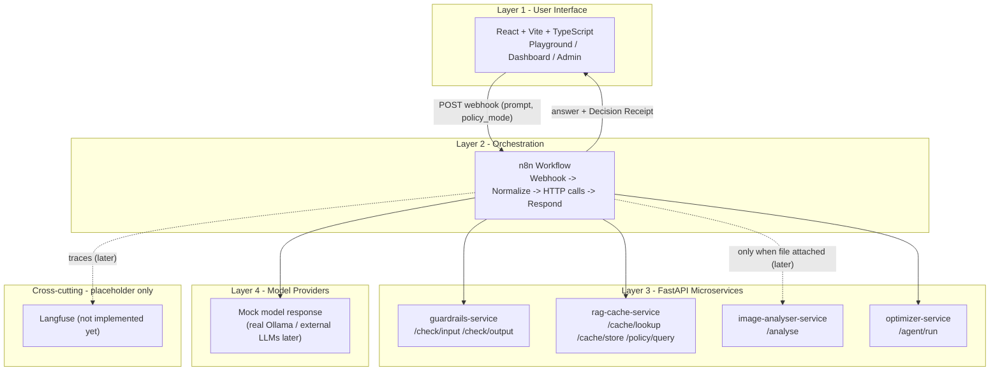
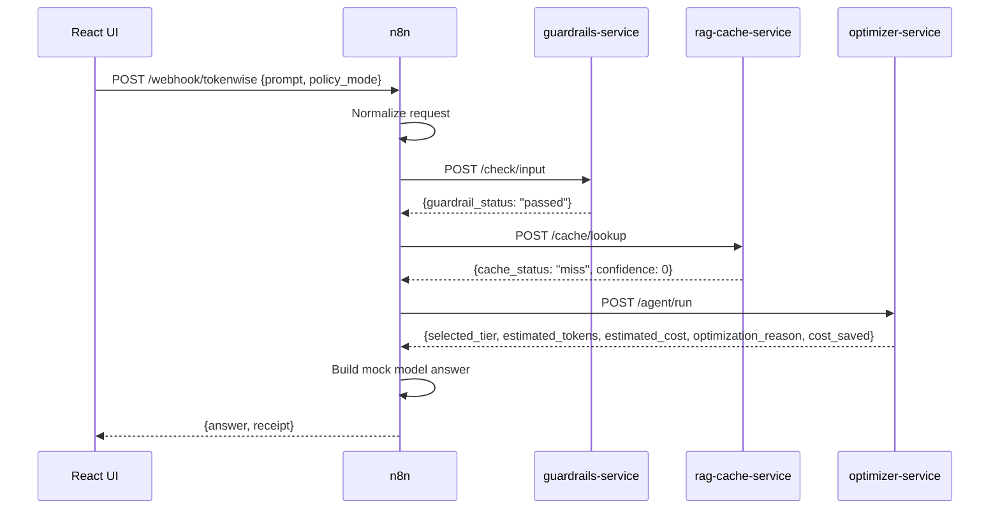

# TokenWise - Architecture (Walking Skeleton, Day 1-2)

TokenWise is a real-time LLM cost-optimization gateway. Every AI request passes
through TokenWise, which optimizes it before it reaches a model, then reports the
savings. This document shows the four-layer architecture that the Day 1-2 walking
skeleton wires together end-to-end (with mocked logic inside each layer).

## Four-layer architecture

## Request flow in the skeleton

## What is real vs mocked in this step

| Layer / concern | Status in skeleton |
|---|---|
| React UI (Playground/Dashboard/Admin) | Real (minimal) |
| n8n orchestration workflow | Real wiring, mock logic |
| 4 FastAPI services + /health | Real services, mock responses |
| Guardrails logic | Mocked (always "passed") |
| Semantic cache / embeddings | Mocked (always "miss") |
| LangGraph optimizer decision | Mocked (static plan) |
| PyTorch image analysis | Mocked (static class) |
| Model provider call | Mocked answer string |
| Langfuse tracing | Placeholder only |
| Usage DB / ROI | Not yet (Dashboard uses mock numbers) |
