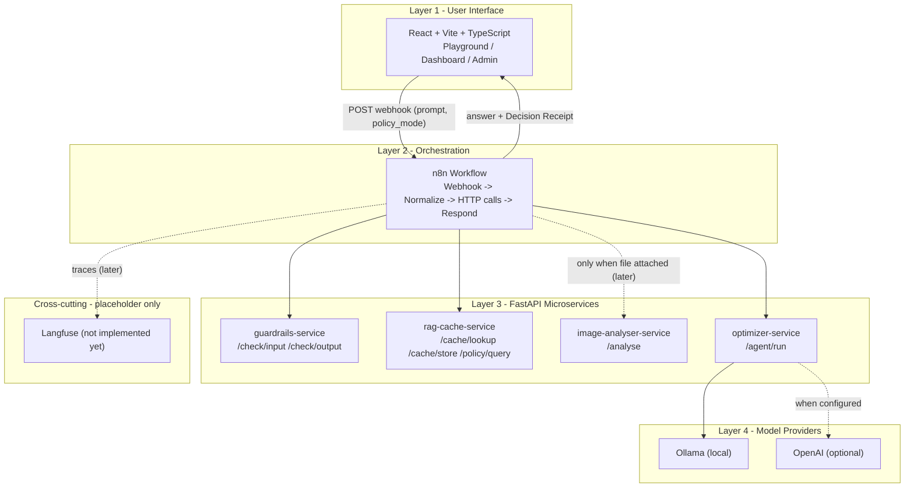
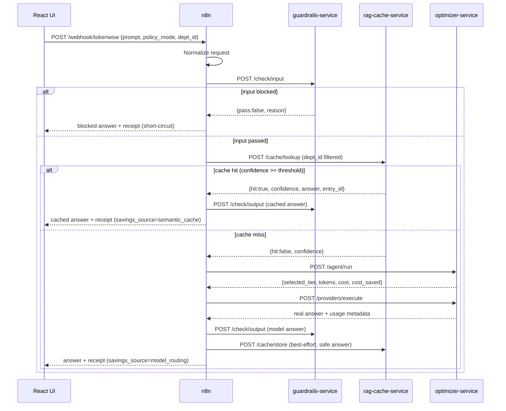
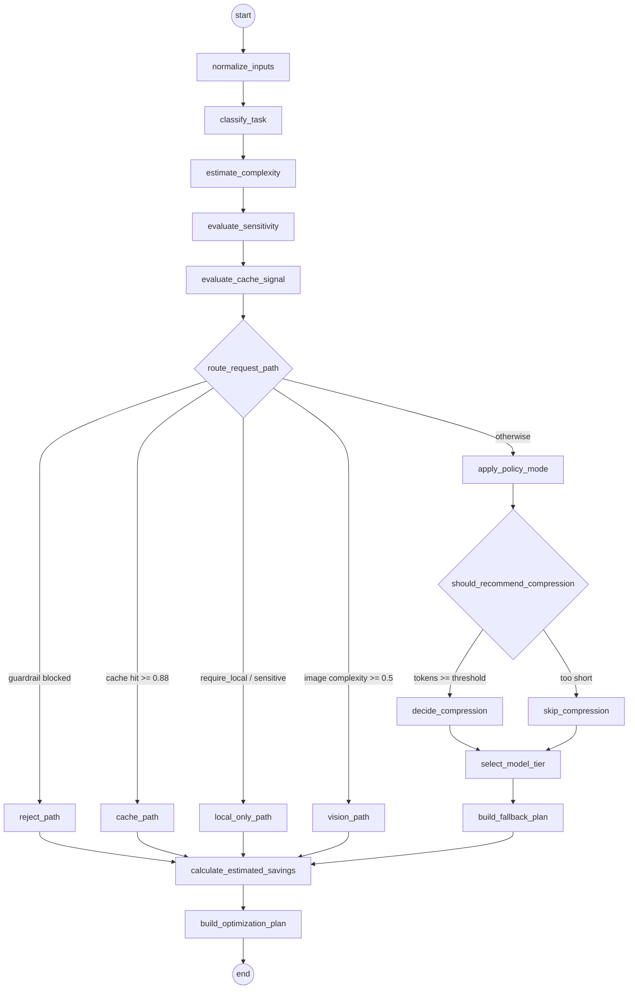
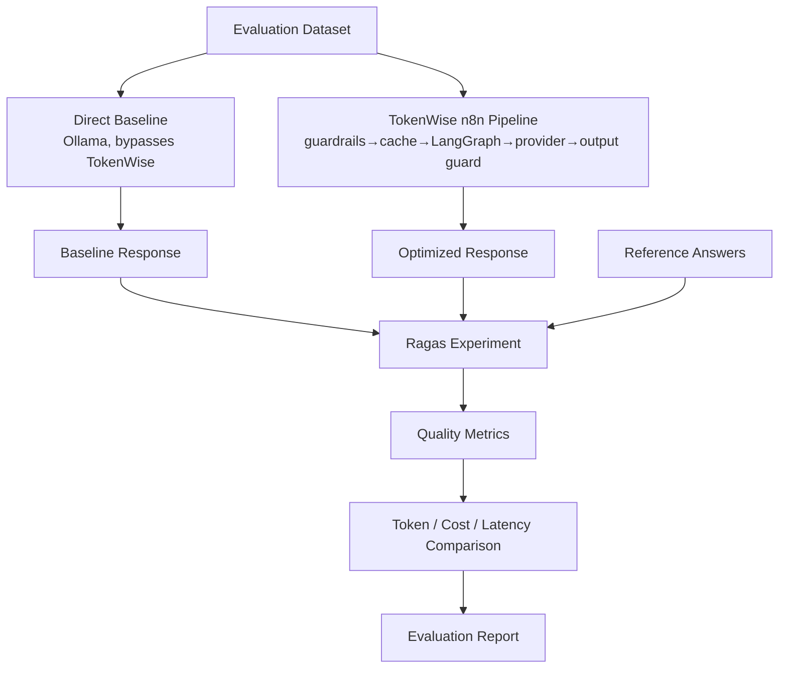

# TokenWise - Architecture (Walking Skeleton, Day 1-2)

TokenWise is a real-time LLM cost-optimization gateway. Every AI request passes
through TokenWise, which optimizes it before it reaches a model, then reports the
savings. This document shows the four-layer architecture that the Day 1-2 walking
skeleton wires together end-to-end (with mocked logic inside each layer).

## Four-layer architecture



## Request flow (with real guardrails + semantic cache)



## Optimizer LangGraph (Day 5 + Day 5.1 conditional graph)

The `optimizer-service` is a deterministic, **conditional** LangGraph state graph.
It is not a linear pipeline: after a shared signal-evaluation prefix, a router
uses **conditional edges** to send each request down one of five distinct paths,
and the standard path has a second conditional edge for compression. This is why
LangGraph is used instead of a plain sequential function - real branching with
inspectable, independently-testable paths. On a cache miss, n8n calls it with the
request + guardrail + cache signals; it returns a structured Optimization Plan.



You can print the compiled graph as Mermaid at any time (uses LangGraph's built-in
exporter, no extra libraries):

```
docker compose run --rm --no-deps optimizer-service \
  python -c "from graph import mermaid; print(mermaid())"
```

**Path priority (in `route_request_path`):**
1. `reject_path` - guardrail blocked (defensive; n8n normally short-circuits first).
2. `cache_path` - cache hit with confidence >= 0.88 (defensive; normally short-circuited).
3. `local_only_path` - `require_local_model` / sensitive: tier `local`, `local_only=true`, `allow_external=false`, no external fallback.
4. `vision_path` - `has_image` and image complexity >= 0.5: tier `vision`, premium multimodal fallback.
5. `standard_optimization_path` - everything else.

**Standard path** runs `apply_policy_mode` then a conditional compression edge:
`decide_compression` only executes when the prompt is long enough for the current
policy mode; otherwise `skip_compression` runs. Then `select_model_tier` ->
`build_fallback_plan`.

**Convergence:** every path (terminal or standard) flows into
`calculate_estimated_savings` -> `build_optimization_plan`, so cost/savings and the
final plan are computed in exactly one place.

**Observability:** the response includes `graph_path` (which branch ran),
`branch_reason` (why), and `executed_nodes` (the exact nodes that executed, via an
append reducer). Skipped branches never appear in `executed_nodes`.

- **Tiers:** local, cheap, balanced, premium, vision, reject, cache, fallback.
- **Complexity** blends length, task type, reasoning keywords, code/doc, image,
  and quality signals (not just length).
- **Policy modes** (conservative/balanced/aggressive) can produce different plans
  for the same prompt.
- Cost uses a static per-1k-token table; savings = premium baseline - optimized,
  never negative. `optimization_plan`, `decision_reasons`, `graph_path`,
  `branch_reason` and `executed_nodes` are surfaced in the Decision Receipt.

## What is real vs mocked in this step

| Layer / concern | Status in skeleton |
|---|---|
| React UI (Playground/Dashboard/Admin) | Real (minimal) |
| n8n orchestration workflow | Real wiring; Provider Execute calls Ollama (re-import workflow after JSON changes) |
| 4 FastAPI services + /health | Real services, mock responses |
| Guardrails logic | Real (Day 3: rules + regex, input & output) |
| Semantic cache / embeddings | Real (Day 4: MiniLM + ChromaDB, cosine, dept isolation) |
| LangGraph optimizer decision | Real (Day 5: multi-node LangGraph, deterministic rules) |
| Usage DB / ROI analytics | Real (Day 7: SQLite in optimizer-service, Dashboard via n8n webhook) |
| Dashboard metrics | Real (Day 7: from GET /usage/summary) |
| PyTorch image analysis | Mocked (static class) |
| Model provider call | Real (Day 6: Ollama local + optional OpenAI via /providers/execute) |
| TokenWise product-answer grounding | Real (capability SoT JSON + deterministic detector; product Q&A only) |
| Structured policy (`policy_mode` config) | Real (config enum drives compression thresholds + tier selection) |
| Policy Evidence Retrieval (`/policy/query`) | Placeholder (returns `{"policies": []}`; not wired into n8n) |
| Ragas AI evaluation | Real, **offline** (Ragas 0.4.3; local Ollama judge + local MiniLM embeddings; not in the request path) |

**Provider execution limit:** at most **two actual HTTP model calls** per request
(one primary, one fallback). Skipped OpenAI configuration checks appear in
`attempts` with `executed=false` and `attempt_role=configuration_check`; they are
not counted in `actual_execution_attempt_count`.

| Langfuse tracing | Placeholder only |

## Offline AI evaluation (Ragas)

Ragas is used as an **offline** AI-evaluation layer (in `evaluation/`), never in
the real-time request path. It runs real Ragas `0.4.3` metrics (collections +
`@experiment` API) on real generated responses and compares an un-optimized
direct baseline against the real TokenWise n8n pipeline.



- **Judge:** local Ollama `llama3.1:latest` via the OpenAI-compatible endpoint
  (`ragas.llms.llm_factory`); no OpenAI key, no LiteLLM proxy.
- **Embeddings:** local `sentence-transformers/all-MiniLM-L6-v2`.
- **Metrics:** Semantic Similarity, Response Relevancy, Factual Correctness, and
  a custom `DomainSpecificRubrics` TokenWise grounding rubric; plus the derived
  `quality_preservation_ratio` and a quality gate (≥ 0.90).
- **Ragas ≠ RAG ≠ Semantic Cache ≠ Langfuse ≠ Usage Analytics.** The generation
  path has no retrieved contexts, so Faithfulness / Context Precision / Recall
  are intentionally not used.

Full methodology, results, and honest limitations:
[docs/evaluation/ragas-evaluation-report.md](evaluation/ragas-evaluation-report.md)
and [evaluation/README.md](../evaluation/README.md).

## Policy Intelligence (design)

TokenWise **Policy Intelligence** is defined as two complementary layers, so that
unstructured retrieved text is never the sole authority for hard runtime decisions:

- **Structured Policy Engine** — deterministic, approved policy values; the runtime
  source of truth that supplies explicit fields to Guardrails and the LangGraph optimizer.
- **Policy Evidence Retrieval** — RAG over uploaded policy documents; supplies clauses,
  source references, and explanations for audit/receipt only. It must not override a
  structured hard rule or auto-enforce extracted text without approval.

Today only the **structured** side exists in a minimal form: `policy_mode`
(`conservative`/`balanced`/`aggressive`) is a config enum flowing UI → n8n → optimizer.
`POST /policy/query` on `rag-cache-service` is a placeholder returning `{"policies": []}`
and is not wired into the n8n flow — so **Policy RAG is not implemented**. The full model
(policy hierarchy, presets, Policy Center, effective-policy preview, document ingestion,
candidate-rule approval, LangGraph integration, Decision Receipt fields, MVP scope,
commercial roadmap, risks) is specified in
[docs/policy-intelligence-design.md](policy-intelligence-design.md).