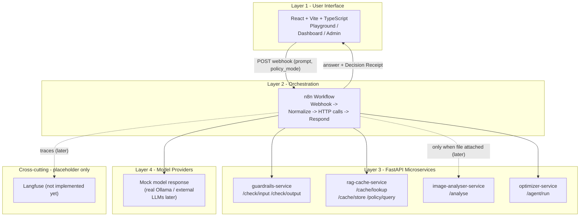
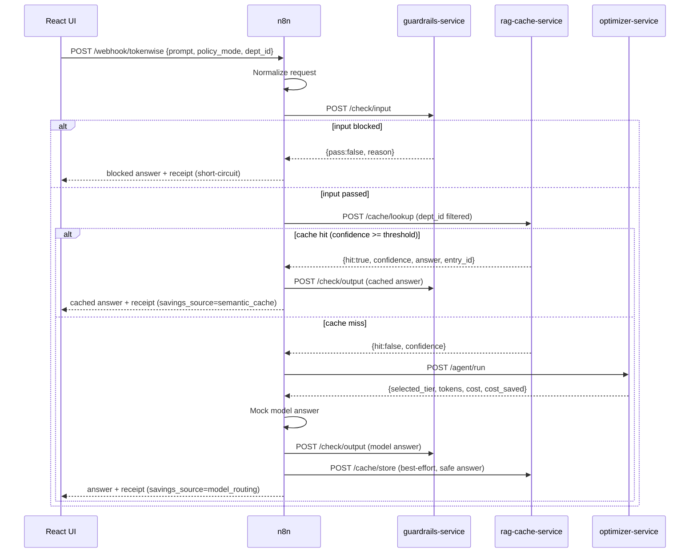
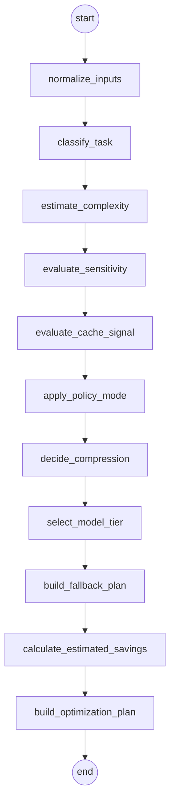

# TokenWise - Architecture (Walking Skeleton, Day 1-2)

TokenWise is a real-time LLM cost-optimization gateway. Every AI request passes
through TokenWise, which optimizes it before it reaches a model, then reports the
savings. This document shows the four-layer architecture that the Day 1-2 walking
skeleton wires together end-to-end (with mocked logic inside each layer).

## Four-layer architecture

## Request flow (with real guardrails + semantic cache)

## Optimizer LangGraph (Day 5)

The `optimizer-service` is a deterministic multi-node LangGraph state graph. On a
cache miss, n8n calls it with request + guardrail + cache signals; it returns a
structured Optimization Plan (tier, compression recommendation, fallback,
cost/savings, decision reasons).

- **Tiers:** local, cheap, balanced, premium, vision, reject, cache, fallback.
- **Sensitive / require_local -> local** (no external fallback).
- **Blocked guardrail -> reject** (defensive; normally short-circuited earlier).
- **Cache hit signal -> cache** (defensive; normally short-circuited earlier).
- **Complexity** blends length, task type, reasoning keywords, code/doc, image,
  and quality signals (not just length).
- **Policy modes** (conservative/balanced/aggressive) can produce different plans
  for the same prompt.
- Cost uses a static per-1k-token table; savings = premium baseline - optimized,
  never negative. `optimization_plan` and `decision_reasons` are surfaced in the
  Decision Receipt.

## What is real vs mocked in this step

| Layer / concern | Status in skeleton |
|---|---|
| React UI (Playground/Dashboard/Admin) | Real (minimal) |
| n8n orchestration workflow | Real wiring, mock logic |
| 4 FastAPI services + /health | Real services, mock responses |
| Guardrails logic | Real (Day 3: rules + regex, input & output) |
| Semantic cache / embeddings | Real (Day 4: MiniLM + ChromaDB, cosine, dept isolation) |
| LangGraph optimizer decision | Real (Day 5: multi-node LangGraph, deterministic rules) |
| PyTorch image analysis | Mocked (static class) |
| Model provider call | Mocked answer string |
| Langfuse tracing | Placeholder only |
| Usage DB / ROI | Not yet (Dashboard uses mock numbers) |
