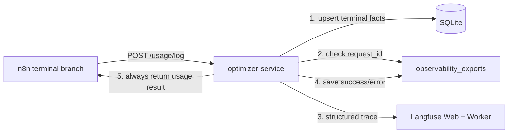

# TokenWise Langfuse Observability (Day 9)

## Purpose

TokenWise exports one privacy-safe Langfuse trace for every terminal request path.
The implementation adds operational visibility without changing the four FastAPI
service architecture and without making Langfuse a dependency of the core stack.

Design goals:

- Cover blocked, cache-hit, model, fallback, image, and output-blocked paths.
- Keep SQLite usage logging as the source of truth.
- Never export raw prompts, generated answers, PII, or secrets.
- Produce one deterministic trace per `request_id`.
- Retry a failed export safely on a later `/usage/log` call.
- Never fail the user request because observability is unavailable.

## Architecture

Every n8n branch already converges on `POST /usage/log`. The optimizer-service first
persists the usage record, then performs the optional export:



No n8n workflow change or re-import is required for Day 9. The exporter lives inside
`optimizer-service` as an MVP packaging decision, alongside the existing usage layer.

## Start The Optional Stack

The regular `docker compose up --build` command starts only TokenWise. Langfuse uses
a separate override because its official self-hosted deployment also requires
Postgres, ClickHouse, Redis, and MinIO.

1. Create the ignored local environment file.

   PowerShell:

   ```powershell
   Copy-Item .env.langfuse.example .env.langfuse
   ```

   macOS/Linux:

   ```bash
   cp .env.langfuse.example .env.langfuse
   ```

2. Replace every `CHANGE_ME` value in `.env.langfuse`.

   Use unique random values. `LANGFUSE_ENCRYPTION_KEY` must be exactly 64 hexadecimal
   characters. Keep the `lf_pk_` and `lf_sk_` prefixes on the project keys. Set
   `LANGFUSE_PUBLIC_URL` to the URL that a browser can open; local development uses
   `http://localhost:3000` while containers ingest through `http://langfuse-web:3000`.

3. Start TokenWise and Langfuse together.

   ```bash
   docker compose --env-file .env.langfuse \
     -f docker-compose.yml \
     -f docker-compose.langfuse.yml \
     up -d --build
   ```

4. Check readiness.

   ```bash
   curl http://localhost:3000/api/public/health
   curl http://localhost:8004/observability/status
   ```

5. Open http://localhost:3000 and sign in with the local credentials from the
   ignored `.env.langfuse` file.

The first pull is intentionally larger than the core stack. Subsequent starts reuse
the Docker images and named volumes.

To stop this deployment without deleting data:

```bash
docker compose --env-file .env.langfuse \
  -f docker-compose.yml \
  -f docker-compose.langfuse.yml \
  down
```

Do not add `--volumes` unless you intentionally want to delete local Langfuse and
TokenWise persisted data.

## Trace Model

The root observation is `tokenwise_request`. Its trace ID is deterministically
derived from `request_id`, so retries point to the same logical trace.

| Observation | Created when | Structured facts |
|---|---|---|
| `input_guardrail` | Always | status, risk category, privacy/redaction flags |
| `semantic_cache_lookup` | Cache status is `hit` or `miss` | status, confidence, department |
| `image_analysis` | Vision/image path ran | provider, selected tier, graph path |
| `optimizer` | A non-reject, non-cache graph path ran | policy mode, route, estimated costs |
| `provider_execution` | A model execution occurred | provider/model, tiers, token usage, cost, latency, fallback |
| `output_guardrail` | Output check ran | status and issue categories |
| `cache_store` | A safe completed miss attempted storage | attempt flag only, no content |
| `usage_log` | Always | request ID and persistence status |

Skipped work does not produce a misleading child observation. For example, a cache
hit has no optimizer or provider generation observation.

## Privacy Contract

Langfuse receives:

- `request_id` and a SHA-256 prompt fingerprint.
- Department, policy mode, task type, status, and graph path.
- Guardrail categories and boolean privacy/redaction flags.
- Provider/model names, selected and executed tiers, and fallback facts.
- Token counts, latency, modeled/actual cost, and savings metadata.

Langfuse never receives:

- Raw prompt text.
- Generated or cached answer text.
- Uploaded image bytes or filenames.
- API keys or infrastructure credentials.

The root and generation inputs explicitly set `prompt_content_logged=false`; output
observations set `answer_content_logged=false`. The local SQLite usage tables also
store only the prompt fingerprint, never the prompt text.

`.env.langfuse` is ignored by Git. `.env.langfuse.example` contains placeholders only
and is safe to commit.

## Reliability And Idempotency

`POST /usage/log` follows this order:

1. Upsert usage data into SQLite.
2. Return the existing successful trace for duplicate `request_id` calls.
3. Otherwise attempt the Langfuse export.
4. Record trace ID, URL, attempt count, success, or bounded error text in
   `observability_exports`.
5. Return the usage result even if steps 2 through 4 fail.

This is deliberately fail-open. Langfuse is diagnostic infrastructure; it cannot be
allowed to break request delivery or invalidate the usage source of truth.

`LANGFUSE_FLUSH_ON_EXPORT=true` is the local default so each terminal request is
immediately visible during demos. A higher-throughput deployment may disable it and
rely on the SDK batcher.

## Diagnostics

Overall status:

```bash
curl http://localhost:8004/observability/status
```

One request:

```bash
curl http://localhost:8004/observability/traces/REQUEST_ID
```

Container state and logs:

```bash
docker compose --env-file .env.langfuse \
  -f docker-compose.yml \
  -f docker-compose.langfuse.yml \
  ps

docker compose --env-file .env.langfuse \
  -f docker-compose.yml \
  -f docker-compose.langfuse.yml \
  logs --tail=200 optimizer-service langfuse-web langfuse-worker
```

Interpretation:

- `requested_enabled=false`: optional tracing was not requested.
- `configured=false`: one or more project credentials are missing.
- `client_ready=false`: inspect `initialization_error` and optimizer logs.
- Trace link uses an unreachable host: verify `LANGFUSE_PUBLIC_URL`; it must be a
  browser-facing URL, not the Docker service name.
- `failed_exports>0`: inspect the individual request endpoint and retry the same
  terminal usage payload after Langfuse recovers.
- Langfuse health fails: inspect Web, Worker, Postgres, ClickHouse, Redis, and MinIO.

## Verification

Day 9 is considered complete when all of these pass:

- Core and override Compose files validate.
- Langfuse health returns `status=OK`.
- Optimizer status reports `active=true` and `client_ready=true`.
- A real request through `http://localhost:5173/api/webhook/tokenwise` completes.
- Optimizer logs show `POST /usage/log` returning HTTP 200.
- The trace status endpoint reports `exported=true` and `attempt_count=1`.
- Langfuse shows the expected observations for the path that ran.
- Searching the full stored trace finds neither the raw prompt nor the answer.
- The optimizer test suite passes, including privacy, stage selection, retry,
  disabled-mode, and handler response regression tests.

The implementation pins the Python SDK in
`services/optimizer-service/requirements.txt`. Deployment topology follows the
[official Langfuse Docker Compose guide](https://langfuse.com/self-hosting/deployment/docker-compose),
and readiness uses the
[official health endpoint](https://langfuse.com/self-hosting/configuration/health-readiness-endpoints).
