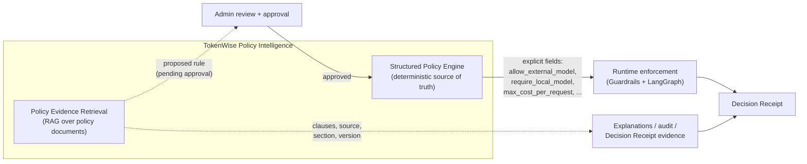
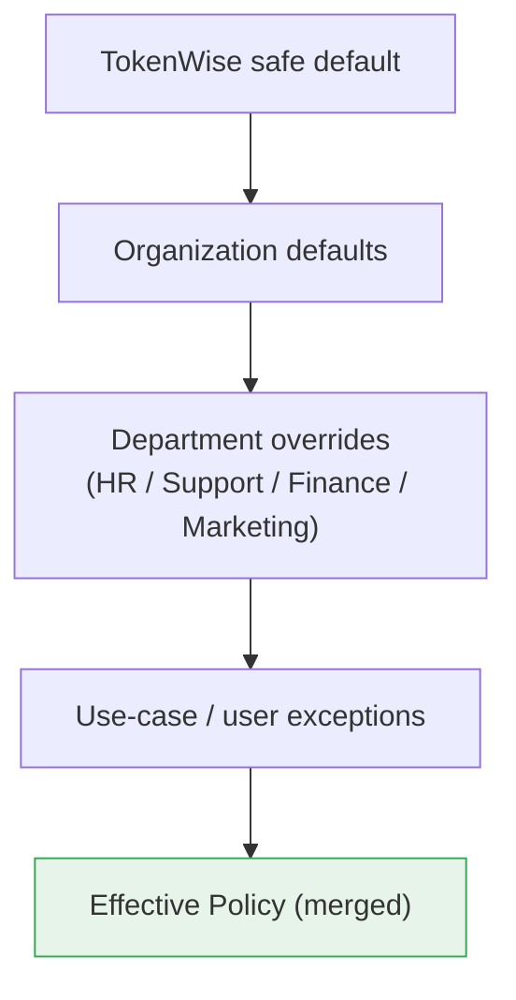
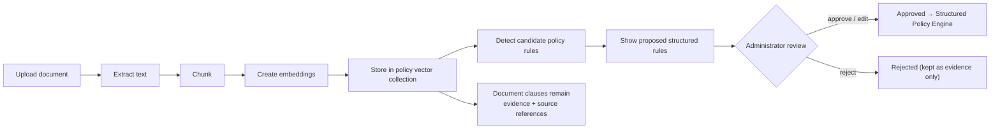
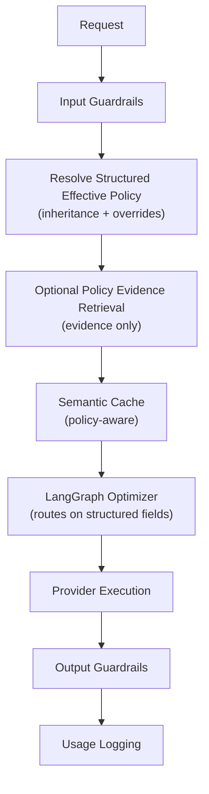

# TokenWise — Policy Intelligence Design

Status: **planning / product-architecture specification** (no runtime code changes).
This document defines the intended TokenWise **Policy Intelligence** model. It corrects
an earlier framing that risked treating unstructured, RAG-retrieved policy text as the
sole authority for hard runtime decisions.

> Scope guard: this is a design and information-architecture document. It does **not**
> implement a Policy Center UI, document ingestion, or candidate-rule extraction, and it
> must **not** delay or replace the mandatory Ragas AI Evaluation, which remains the next
> implementation step. Final visual design belongs to the UX/UI designer's Figma files.

---

## 1. Problem statement

The original "Policy Retrieval" concept assumed a customer would author many policies per
department and/or upload every company document before TokenWise became useful, with
retrieved natural-language text driving routing, privacy, budget, and provider decisions.

That framing has two problems:

1. **Operational complexity.** Requiring hundreds of hand-authored rules per department,
   or a full document corpus, before first value is high adoption friction.
2. **Commercial imprecision.** Using ambiguous, unstructured retrieved text as the source
   of truth for *hard* enforcement (privacy, budget, provider allow-lists) is unpredictable,
   hard to audit, and unsafe. Retrieval is probabilistic; enforcement must be deterministic.

TokenWise must remain **simple to understand, fast to configure, commercially credible,
safe and auditable, and scalable across departments without duplicating configuration.**

---

## 2. Product principles

- **Deterministic enforcement, probabilistic explanation.** Hard rules come from a
  structured store; retrieved documents provide supporting evidence and human-readable
  rationale, never silent override.
- **Start simple, mature gradually.** A customer starts from one preset and adjusts a few
  values. Documents are optional and additive.
- **Configure differences, not duplicates.** Departments inherit organization defaults and
  declare only overrides/exceptions.
- **Everything auditable.** Every effective decision can be traced to a rule, its scope, and
  (optionally) an evidence source.
- **Approval before enforcement.** A candidate rule extracted from a document never becomes
  an enforced rule without explicit administrator approval.

---

## 3. Two-layer Policy Intelligence

TokenWise **Policy Intelligence** is composed of two complementary layers.

### 3.1 Structured Policy Engine (source of truth)

- Stores **approved, deterministic policy values**.
- Is the **runtime source of truth** for enforcement.
- Supplies **explicit structured fields** to Guardrails and to the LangGraph optimizer.
- Is auditable, versionable, and predictable.
- Resolves the **effective policy** for a request via the inheritance model (Section 4).

### 3.2 Policy Evidence Retrieval (supporting context)

- Uses embeddings / vector retrieval over uploaded company-policy documents.
- Supplies **relevant clauses, source references, explanations, and audit evidence**.
- **Must not** independently override a structured hard rule.
- **Must not** turn ambiguous natural-language text directly into an enforced production
  rule without approval.
- Feeds **explanations**, **Decision Receipt evidence**, **admin review**, **audit reports**,
  **candidate-rule extraction**, and **human investigation**.



**One-line rule:** *Structured Policy decides; Evidence Retrieval explains.*

---

## 4. Policy hierarchy (inheritance model)

A simple three-level inheritance model, resolved by priority:

```
Level 1 — Organization defaults
Level 2 — Department overrides
Level 3 — Optional use-case / user exceptions
```

**Resolution priority (highest wins):**

```
approved specific exception
  → department override
    → organization default
      → TokenWise safe default
```

A department **inherits** the organization policy automatically. Administrators configure
**only differences and exceptions** — never a full copy of the organization policy.

### Worked example

| Layer | Setting |
|---|---|
| Organization | external providers allowed; balanced mode; premium requires approval |
| HR override | sensitive requests **local-only** |
| Support override | prefer semantic cache + cheap tier |
| Marketing override | premium allowed for campaign strategy |

Effective policy for an HR request containing sensitive data = organization defaults **plus**
the HR local-only override → **external provider prohibited** for that request.



---

## 5. Simple policy presets

Presets are **onboarding accelerators, not rigid limitations.** A new customer starts from
one preset and adjusts a few values. Each preset configures a coherent bundle.

| Field | Balanced | Cost First | Privacy First | Premium Quality |
|---|---|---|---|---|
| Provider permissions | external allowed | external allowed | **local-only preferred** | external allowed |
| Model-tier preference | cheapest meeting quality | local/cheap first | local first | balanced/premium |
| Sensitive-data handling | redact + route local | redact + route local | **local-only, no external** | redact + route local |
| Premium-model approval | required | required | required | **auto-allowed** |
| Cache behavior | on (0.88) | **on, aggressive reuse** | on but stricter for sensitive | on |
| Compression tolerance | moderate | **high** | low | **minimal** |
| Per-request cost guard | moderate cap | **tight cap** | moderate cap | **high cap** |
| Logging / privacy mode | standard | standard | **privacy-max (fingerprint-only)** | standard |

Presets are a starting point; every field remains individually overridable at the
organization and department levels.

---

## 6. Policy Center (future Admin product concept)

**Policy Center** is a future Admin area. This document specifies **functional requirements
and information architecture only** — no layouts, navigation, branding, typography, or visual
components (those are the Figma designer's deliverables).

Recommended sections:

- **A. Organization Defaults** — the base policy (or chosen preset).
- **B. Department Overrides** — per-department differences only.
- **C. Approved Providers & Models** — allow-lists for providers and models/tiers.
- **D. Budgets and Premium Access** — monthly department budgets, per-request cost cap,
  premium permission + approval requirement.
- **E. Sensitive Data Rules** — local-only requirements, redaction, human-approval triggers.
- **F. Policy Documents** — optional document upload + evidence collection.
- **G. Audit and Effective Policy Preview** — the trust surface.

### 6.1 Effective Policy Preview (most important capability)

Given an admin selection of **department + request type + sensitivity level**, TokenWise shows
the **final merged policy** after inheritance and overrides, with the origin of each value.

```
Input:   department = HR, request type = general, sensitivity = sensitive
Org default:   External providers allowed
HR override:   Sensitive content must remain local
──────────────────────────────────────────────
Effective:     External provider PROHIBITED for this HR request
               (source: department override "hr.sensitive_local_only")
```

This preview reduces confusion, exposes conflicts before runtime, and makes the policy system
auditable.

---

## 7. Policy document upload (optional, future)

Document upload is **optional**. TokenWise must remain fully usable with **presets +
structured settings + department overrides** even when no document has been uploaded.

Intended future workflow:



A candidate rule is **never** auto-enforced. Extracted clauses always remain available as
evidence and source references regardless of approval outcome.

---

## 8. Candidate-rule extraction (commercial roadmap — do not implement now)

A safe review workflow turns detected statements into **proposed** structured rules with a
`pending_approval` status.

Example proposal:

```json
{
  "source": "security-policy.pdf, section 4.2",
  "detected_statement": "Candidate personal information must not leave the company network.",
  "suggested_rule": {
    "scope": "department",
    "department": "hr",
    "condition": "contains_sensitive_data",
    "require_local_model": true,
    "allow_external_model": false
  },
  "status": "pending_approval"
}
```

An authorized administrator can **approve**, **edit**, or **reject**. Every action is
auditable (who, when, source, before/after). This workflow is documented intent, **not**
implemented in the academic MVP.

---

## 9. Structured settings vs Policy Evidence Retrieval

### 9.1 What belongs in **structured** policy (deterministic fields)

These are explicit operational controls, stored deterministically and used for enforcement:

- approved providers
- approved models
- model tiers allowed
- local-only requirement
- external-provider permission
- premium-model permission
- premium approval requirement
- monthly department budget
- maximum modeled cost per request
- cache enabled/disabled
- semantic-cache threshold
- prompt-compression permission
- data-retention mode
- Langfuse logging/privacy mode
- human-approval requirement

### 9.2 What belongs in **Policy Evidence Retrieval** (RAG)

RAG retrieves supporting material, never a hard decision authority:

- relevant policy clauses
- source document
- document version
- section / page reference
- department applicability
- effective date
- explanatory guidance
- examples and exceptions written in natural language

RAG output supports LangGraph explanations, Decision Receipt evidence, admin review, audit
reports, candidate-rule extraction, and human investigation. It must **not** silently become
the source of truth for a hard security or budget decision.

---

## 10. Runtime flow

Revised planned runtime flow:

```
Request
  → Input Guardrails
  → Resolve Structured Effective Policy
  → Optional Policy Evidence Retrieval
  → Semantic Cache
  → LangGraph Optimizer
  → Provider Execution
  → Output Guardrails
  → Usage Logging
```



### 10.1 Ordering rationale (cache vs policy)

Effective policy is resolved **before** the semantic cache so a **cache hit still respects the
current effective policy.** The exact position of Policy Evidence Retrieval relative to the
cache may vary by safety needs; because evidence retrieval is non-authoritative, it can run in
parallel or be deferred without changing enforcement. Structured resolution, however, must
precede any decision that a cache hit could short-circuit.

### 10.2 Policy-aware cache invalidation (commercial requirement — do not implement now)

A cache hit must still respect the effective policy:

- a cached answer must not cross department boundaries;
- a sensitive request must not reuse an unsafe cache entry;
- an updated policy may invalidate an older cache entry.

Policy-aware cache invalidation is documented as a **commercial requirement**, not built in
this planning task.

---

## 11. LangGraph integration design

The future LangGraph state should receive **structured** policy fields:

- `effective_policy_id`
- `organization_policy_mode`
- `department_policy_mode`
- `allowed_providers`
- `allowed_models`
- `allow_external_model`
- `require_local_model`
- `allow_premium`
- `premium_requires_approval`
- `max_cost_per_request`
- `compression_allowed`
- `cache_allowed`
- `retrieved_policy_evidence`

**Routing decisions must use the structured fields.** Retrieved policy evidence
(`retrieved_policy_evidence`) may be used to **explain** the decision, **identify relevant
exceptions**, and **provide an audit source** — but an LLM must **not** be required to
interpret every policy document on every runtime request.

This extends (does not replace) today's optimizer inputs. Today the optimizer already consumes
structured signals (`require_local_model`, `allow_external_model`, `policy_mode`, etc.); the
future fields above generalize `policy_mode` into an explicit, inheritance-resolved effective
policy plus a non-authoritative evidence attachment.

---

## 12. Current implementation assessment

Inspected at checkpoint `5682eea`. Findings are precise; **Policy RAG is not implemented.**

| Question | Finding |
|---|---|
| What does `POST /policy/query` do? | **Placeholder.** Handler in `services/rag-cache-service/main.py` ignores `prompt`/`k` and returns `{"policies": []}`. The module docstring says "no retrieval yet." |
| Is any policy collection seeded? | **No.** The only Chroma collection is `semantic_cache`. No seed scripts, no policy document dataset, no policy embeddings. |
| Does LangGraph receive retrieved policies? | **No.** `AgentRunRequest` has no `policies`/`retrieved_policies`/`policy_text` field. `OptimizerState` has no retrieved-policy input. |
| Do retrieved policies influence routing? | **No — none exist.** Routing uses structured signals only. |
| Are `policy_mode` values structured config or retrieval results? | **Structured config.** `policy_mode ∈ {conservative, balanced, aggressive}`, set in Admin/Playground UI, normalized in `normalize_inputs`. Not retrieval. |
| What is real? | `policy_mode` end-to-end (UI → n8n → optimizer → usage DB); optimizer compression/tier logic driven by `policy_mode`; guardrails hardcoded safety/cost rules emitting routing fields (`require_local_model`, `allow_external_model`, `recommended_route`, `contains_sensitive_data`, `requires_redaction`). |
| What is placeholder? | `POST /policy/query`; any policy vector collection/seed; n8n call to `/policy/query` (never wired); retrieved-policy influence on decisions. |
| Which naming is misleading? | `rag-cache-service` name implies broad RAG but only a semantic Q/A cache exists; `/policy/query` implies active retrieval but always returns empty; `policy_mode` can be misread as "policy from RAG" but is a 3-value config; `policy_triggered` (guardrails) is a governance-rule category, not a retrieved document. |

**Explicit statement:** TokenWise does **not** currently implement Policy RAG. It implements a
structured `policy_mode` configuration and hardcoded guardrail governance rules. `/policy/query`
is a stub.

---

## 13. Naming recommendation

Avoid presenting the feature simply as "Policy RAG," which obscures the distinction between
**enforced rules** and **retrieved supporting text.**

Recommended naming hierarchy:

- **Policy Intelligence** — the overall product capability (umbrella term).
  - **Structured Policy Engine** — the deterministic enforcement layer (source of truth).
  - **Policy Evidence Retrieval** — the RAG-based retrieval layer (supporting evidence).
- **Policy Center** — the user-facing Admin feature that configures and previews the above.

Naming guidance for the codebase:

- Keep `policy_mode` as-is but document it as an **optimization aggressiveness config**, not
  a retrieval result.
- If/when retrieval is built, name the endpoint and collection to reflect **evidence**
  (e.g., `/policy/evidence` or a `policy_evidence` collection) so it is never confused with
  enforcement.
- Treat `policy_triggered` (guardrails) as a **governance-rule category**, distinct from a
  policy document.

---

## 14. Business reasoning

**Why this architecture is commercially stronger:**

- **Fast onboarding** — start from a preset, adjust a few values.
- **Presets reduce configuration burden** — coherent bundles instead of blank slates.
- **Inheritance avoids duplicated rules** — departments declare only differences.
- **Optional documents reduce adoption friction** — usable with zero uploads.
- **Approval prevents incorrect automatic enforcement** — no silent rule creation.
- **Structured rules improve predictability** — deterministic, testable enforcement.
- **RAG evidence improves explainability** — clauses + sources on the receipt.
- **Effective-policy preview improves trust** — see the merged result before runtime.
- **Audit source supports enterprise governance** — every decision is traceable.
- **Customers can start simple and mature gradually** — presets → overrides → documents.

**Risks and mitigations:**

| Risk | Mitigation |
|---|---|
| Conflicting policies | Deterministic priority order + Effective Policy Preview surfaces conflicts pre-runtime. |
| Stale documents | Document version + effective date on evidence; periodic review prompts; evidence is non-authoritative. |
| Ambiguous text | Text never auto-enforces; only proposes candidate rules for human approval. |
| Incorrect extraction | Mandatory approve/edit/reject review with audit trail. |
| Excessive overrides | Preview + audit highlight override sprawl; recommend minimal-difference configuration. |
| Policy drift | Versioning + audit + (future) policy-aware cache invalidation. |
| Outdated cache entries | Resolve effective policy before cache; document policy-aware invalidation as a commercial requirement. |
| Permission / ownership questions | Structured ownership per scope; (future) RBAC for who can approve rules; every action auditable. |

---

## 15. MVP scope (academically credible, minimal)

Clearly separated into three tiers.

### 15.1 Must-have academic MVP

- **One** organization policy.
- **Three** presets (Balanced, Cost First, Privacy First — Premium Quality optional).
- **Two or three** demo departments: **HR, Support, Finance**.
- Inheritance from organization defaults.
- A **small number** of department overrides (e.g., HR local-only for sensitive).
- **One** seeded policy-document dataset.
- **One** real `/policy/query` (evidence) retrieval result.
- Retrieved source shown in **structured metadata** (Decision Receipt evidence fields).
- LangGraph decision influenced by **one approved structured department policy**.

### 15.2 Should-have (if time remains)

- Effective Policy Preview (read-only) for the three demo departments.
- A second department override and a single use-case exception.
- Evidence excerpt + document version rendered in the receipt's advanced section.

### 15.3 Explicitly deferred (post-academic commercial roadmap)

Do **not** build within the two-week academic MVP:

- full PDF management
- enterprise document versioning
- complex RBAC
- approval workflows
- hundreds of rules
- multi-country compliance engines
- automated production policy extraction
- policy-aware cache invalidation

---

## 16. Decision Receipt implications

Plan future **functional** fields (not final visual hierarchy):

- `effective_policy`
- `policy_scope`
- `organization_default_applied`
- `department_override_applied`
- `policy_rule_triggered`
- `policy_effect`
- `policy_evidence_source`
- `policy_evidence_excerpt`
- `policy_document_version`

Keep the main user-facing receipt **concise**. Recommended future grouping:

- **Optimization Summary:** selected route, savings, guardrail status, cache status,
  policy effect.
- **Advanced Decision Details:** graph path, executed nodes, complete decision reasons,
  provider attempts, policy evidence.

The final visual hierarchy is **not** implemented here; the designer's Figma files remain the
visual source of truth.

---

## 17. Updated roadmap

**Immediate mandatory:**

1. **Ragas AI Evaluation** (next implementation step — not delayed or replaced).

**Then:**

2. PyTorch Image Analyser (Day 8 work is currently stashed; see repository notes).
3. Langfuse.
4. Integration and benchmark.

**Policy Intelligence MVP (only if sufficient time remains):**

5. Implement the smallest approved structured-policy + one-result evidence retrieval
   demonstration (Section 15.1).

**Final:**

6. Apply the professional Figma design; implement the final visual hierarchy and Policy
   Center design only per approved scope.

**Commercial roadmap:**

- full Policy Center; document ingestion; candidate-rule extraction; approval workflow;
  versioning; audit; multi-level scope; policy-aware cache invalidation.

---

## 18. Remaining questions

- Ownership model: which roles may edit organization vs department policy, and who may
  approve candidate rules (drives future RBAC scope)?
- Budget enforcement semantics: is `max_cost_per_request` a hard block, a downgrade trigger,
  or an approval trigger?
- Evidence retrieval placement: parallel to the cache vs before the optimizer — to be decided
  per latency/safety benchmarks during integration.
- Document formats to support first (PDF only vs PDF + DOCX + Markdown).

---

## 19. Exact next implementation step

**Implement Ragas AI Evaluation.** Policy Intelligence remains a documented design; the Policy
Center UI and retrieval are deferred. The stashed Day 8 image-analyser work stays stashed until
Ragas is fully implemented, tested, evaluated, and pushed.
