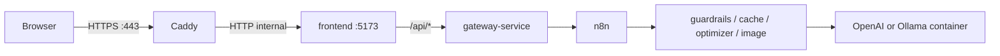

# MomiHelm Web Deployment

This guide explains how to run MomiHelm on the public internet instead of
`127.0.0.1:5173`. The web stack keeps n8n, the gateway, and all Python services
private inside Docker. Only **Caddy** publishes ports **80** and **443** and
proxies traffic to the production frontend.

## What you need

1. **A Linux server or VPS** with Docker and Docker Compose installed.
2. **Open ports 80 and 443** on the server firewall and cloud security group.
3. **A domain name** whose DNS `A` or `AAAA` record points at the server
   (recommended for HTTPS).
4. **A model provider**:
   - **OpenAI** (recommended for small VPS instances), or
   - **Bundled Ollama container** (needs roughly 8 GB+ RAM and ~10 GB disk for
     `llama3.1:latest`).

## Quick start on a server

### 1. Clone the repo

```bash
git clone https://github.com/tomeryoel/tokenwise.git
cd tokenwise
```

### 2. Create the web environment file

```bash
cp .env.web.example .env
```

Edit `.env`:

| Variable | Example | Purpose |
|---|---|---|
| `MOMIHELM_PUBLIC_DOMAIN` | `app.example.com` | Public hostname |
| `MOMIHELM_PUBLIC_URL` | `https://app.example.com` | URL shown after startup |
| `MOMIHELM_ACME_EMAIL` | `you@example.com` | Let's Encrypt contact email |
| `MOMIHELM_ALLOWED_ORIGINS` | `https://app.example.com` | Must match browser origin exactly |
| `MOMIHELM_COOKIE_SECURE` | `true` | Required for HTTPS sessions |
| `ENABLE_OPENAI_PROVIDER` | `true` | Use OpenAI instead of local Ollama |
| `OPENAI_API_KEY` | `sk-...` | Required when OpenAI is enabled |

For OpenAI on a small VPS, set:

```env
ENABLE_OPENAI_PROVIDER=true
OPENAI_API_KEY=sk-your-key
OPENAI_CHEAP_MODEL=gpt-4o-mini
OPENAI_BALANCED_MODEL=gpt-4o-mini
OPENAI_PREMIUM_MODEL=gpt-4o
```

For self-hosted Ollama in Docker, keep the defaults in `.env.web.example` and
ensure the server has enough disk and RAM.

### 3. Point DNS at the server

Create an `A` record (or `AAAA` for IPv6):

```text
app.example.com  ->  YOUR.SERVER.IP
```

Wait until DNS resolves before starting HTTPS.

### 4. Validate and start

```bash
./momihelm web-doctor
./momihelm web-start
```

On first start with bundled Ollama, `./momihelm web-start` pulls
`llama3.1:latest` into the container (about 4.6 GB).

### 5. Open the site and create the owner account

Visit `https://app.example.com`, complete first-run owner setup, then sign in.

### 6. Run the smoke test

```bash
./momihelm web-smoke
```

## Web lifecycle commands

| Action | Command |
|---|---|
| Validate config | `./momihelm web-doctor` |
| Start public stack | `./momihelm web-start` |
| Status | `./momihelm web-status` |
| Logs | `./momihelm web-logs` |
| Smoke test | `./momihelm web-smoke` |
| Stop | `./momihelm web-stop` |

Local commands (`./momihelm start`, etc.) still work for development on your
machine. Do not run local and web stacks on the same host at the same time
unless you understand the port and volume overlap.

## Architecture



## HTTP-only demo mode (not recommended)

If you do not have a domain yet, you can expose plain HTTP on port 80:

```env
MOMIHELM_WEB_TLS=false
MOMIHELM_PUBLIC_URL=http://203.0.113.10
MOMIHELM_ALLOWED_ORIGINS=http://203.0.113.10
MOMIHELM_COOKIE_SECURE=false
```

Sessions will not be secure on untrusted networks. Use this only for temporary
demos.

## Troubleshooting

### Let's Encrypt certificate fails

- Confirm DNS for `MOMIHELM_PUBLIC_DOMAIN` resolves to this server.
- Confirm ports 80 and 443 are reachable from the internet.
- Check Caddy logs: `./momihelm web-logs`

### Login works locally but POST requests return `untrusted_origin`

`MOMIHELM_ALLOWED_ORIGINS` must exactly match the browser origin, including
`https://` and with no trailing slash.

### Model requests fail on a small VPS

Switch to OpenAI in `.env`, then restart:

```bash
./momihelm web-stop
./momihelm web-start
```

### Backend services are not exposed

This is intentional. Only Caddy is public. Use `./momihelm web-logs` and
`./momihelm web-status` for diagnostics.

## Production notes

This web stack is an MVP deployment path, not a full SaaS platform. Before a
commercial launch, plan for:

- Managed database instead of SQLite
- Automated backups for Docker volumes
- Rate limiting and WAF in front of Caddy
- Monitoring and alerting
- Staging environment and CI/CD

For local development, keep using `./momihelm start` at
`http://127.0.0.1:5173`.
