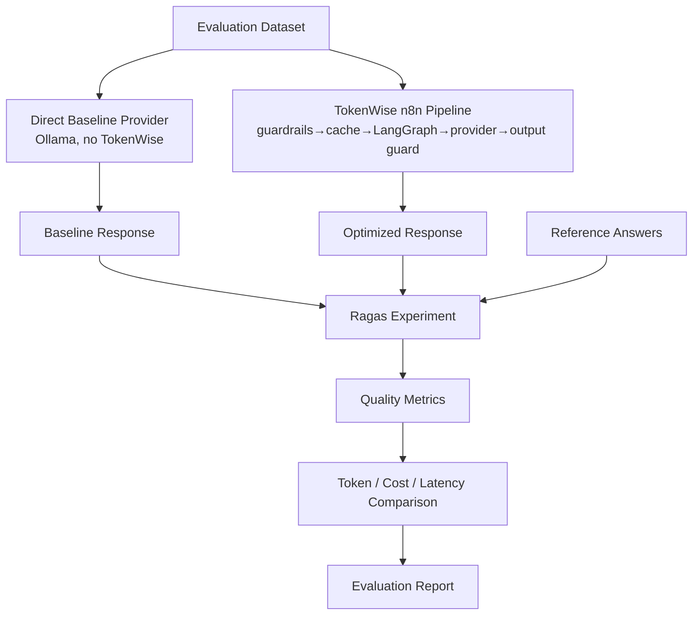

# TokenWise — Offline Ragas AI Evaluation

This directory contains the **offline** [Ragas](https://docs.ragas.io) evaluation
layer for TokenWise. It runs **real Ragas metrics on real generated responses**
and produces saved, reviewable artifacts. It is an experimentation layer — **not**
a production service and **never** part of the real-time request path.

> Lecturer requirement: the project must use Ragas for AI evaluation. This layer
> satisfies that with genuine Ragas scoring (no fabricated scores).

## Why Ragas, and how it differs from other TokenWise pieces

| Concept | What it is | Where it lives |
|---|---|---|
| **Ragas** | Offline **evaluation** of answer quality (semantic similarity, relevancy, factual correctness, custom rubric) | This directory, run on demand |
| **RAG** | Retrieval-augmented generation (retrieve documents → ground an answer) | Not implemented in the generation path; do not confuse with Ragas |
| **Semantic Cache** | Runtime cost optimization: returns a stored answer for a similar prompt | `rag-cache-service` (production) |
| **Langfuse** | Runtime tracing/observability of requests | Not implemented yet (roadmap) |
| **Usage Analytics** | Aggregated cost/usage dashboard from the usage DB | optimizer-service + n8n + React Dashboard |

Ragas answers "**is the answer good?**" offline; it is neither RAG, nor the
semantic cache, nor tracing, nor the usage dashboard.

## What it measures

Two execution variants are compared on a curated dataset:

- **Baseline** — a direct Ollama call with a fixed model, bypassing TokenWise
  entirely (no guardrails, no cache, no LangGraph routing, no fallback, no
  savings mechanisms).
- **TokenWise (optimized)** — the **real** n8n webhook pipeline:
  `n8n → Input Guardrails → Semantic Cache → LangGraph Optimizer → Provider
  Execution → Output Guardrails → Usage Logging`.



## Ragas version & API style

- **Ragas `0.4.3`** (pinned in `requirements.txt`).
- API style: the current **`@experiment()` + collections** API
  (`ragas.metrics.collections`, scored via `.ascore(...)` returning
  `MetricResult`), **not** the deprecated `from ragas import evaluate` batch API
  (removed in Ragas 1.0). `assert_ragas_api()` fails loudly if the expected API
  is missing, and a unit test asserts the deprecated import is never used.
- Compatibility note: Ragas 0.4.3 declares **unpinned** langchain deps; the
  langchain **1.x** stack breaks `ragas.llms.base`
  (`langchain_community.chat_models.vertexai` was removed), so the **0.3.x**
  langchain line is pinned for compatibility.

## Judge & embeddings (fully local, no secrets)

- **Judge (LLM evaluator):** local **Ollama** `llama3.1:latest`, driven through
  Ollama's OpenAI-compatible endpoint via `ragas.llms.llm_factory` + an
  `AsyncOpenAI` client (no LiteLLM proxy, no OpenAI key required).
- **Embeddings:** local Hugging Face **`sentence-transformers/all-MiniLM-L6-v2`**
  (CPU, normalized) via `ragas.embeddings.HuggingFaceEmbeddings`.
- The custom rubric uses the Ragas collections `DomainSpecificRubrics` metric
  (robust structured-output path) because a hand-rolled `NumericMetric` was
  flaky with `llama3.1` (the model occasionally echoed the JSON schema).
- Optional external (OpenAI) judge is **disabled by default** and never used
  silently.

## Metrics

| Metric | Type | Source |
|---|---|---|
| Semantic Similarity | embeddings | `collections.SemanticSimilarity` (MiniLM) |
| Response Relevancy | LLM + embeddings | `collections.AnswerRelevancy` |
| Factual Correctness | LLM | `collections.FactualCorrectness` |
| TokenWise Grounding Rubric (1-5 → 0-1) | LLM | `collections.DomainSpecificRubrics` (custom rubric) |

**quality_preservation_ratio** is a **TokenWise-derived** project metric (not a
Ragas built-in): the ratio of the optimized mean composite quality to the
baseline mean composite quality. Composite quality weights: semantic 0.35,
relevancy 0.25, factual 0.25, rubric 0.15; **missing/failed metrics are excluded
and remaining weights renormalized** (a failed metric is never a fake 0).

Faithfulness / Context Precision / Context Recall are intentionally **not** used:
the generation path has no real retrieved contexts, and the Semantic Cache is not
RAG.

## Dataset

`datasets/tokenwise_eval_dataset.json` — 13 curated, safe cases:

- **Answer-quality** (8): TokenWise architecture grounding, semantic cache,
  guardrails, general QA, explanation, summarization, code explanation, reasoning.
- **Behavioral** (5): prompt-injection block, secret block, off-topic block,
  PII→local-only redaction, semantic-cache repeat hit.

Includes the mandatory grounding case
`Explain how TokenWise chooses between a local model and an external model.`
whose reference describes **only currently-implemented behavior**; the rubric
penalizes claims of unimplemented capabilities. No real PII/secrets — the PII
case uses `evaluation.user@example.invalid`.

## Run it (host-side Python CLI — primary, validated path on Windows)

From the repository root, using the isolated venv:

```powershell
# one-time setup
py -3.13 -m venv evaluation\.venv
evaluation\.venv\Scripts\python.exe -m pip install --upgrade pip
evaluation\.venv\Scripts\python.exe -m pip install torch==2.13.0 --index-url https://download.pytorch.org/whl/cpu
evaluation\.venv\Scripts\python.exe -m pip install -r evaluation\requirements.txt

# environment validation (Test A): prints Ragas version, runs one real metric
evaluation\.venv\Scripts\python.exe -m evaluation.ragas_eval.run_evaluation --env-check

# smoke (fast, 4 cases) — warm-up is automatic
evaluation\.venv\Scripts\python.exe -m evaluation.ragas_eval.run_evaluation --mode smoke

# full (all 13 cases, all applicable metrics)
evaluation\.venv\Scripts\python.exe -m evaluation.ragas_eval.run_evaluation --mode full
```

Prerequisites: Ollama running with `llama3.1:latest` pulled, and the TokenWise
stack up (`docker compose up -d`) so the n8n webhook + optimizer are reachable.

### Optional: one-off Docker profile

```bash
docker compose --profile evaluation run --rm evaluation-runner --mode smoke
docker compose --profile evaluation run --rm evaluation-runner --mode full
```

The runner is **not** a persistent service (profile-gated) and writes artifacts
to `evaluation/results/` on the host.

## Result artifacts

Each run writes `evaluation/results/<run-id>/`:

`config.json`, `dataset_snapshot.json`, `baseline_results.csv`,
`tokenwise_results.csv`, `ragas_scores.csv`, `comparison.csv`, `summary.json`,
`report.md`, and `errors.json` (only if errors occurred).

Timestamped runs are **git-ignored**; only the canonical reviewed report is
committed at `docs/evaluation/ragas-evaluation-report.md`.

## Usage Dashboard contamination

Every run uses a dedicated department `ragas-eval-<run-id>` so evaluation traffic
is isolated in the usage DB (filter it out in the Dashboard). No usage records
are deleted or reset.

## Tests

```powershell
cd evaluation
..\evaluation\.venv\Scripts\python.exe -m pytest -q
```

Unit tests mock all external HTTP/LLM calls and make no paid calls.

## Honest limitations

See the limitations section of any generated `report.md` /
`docs/evaluation/ragas-evaluation-report.md`. In short: small curated dataset;
same local model may act as generator and judge (evaluator bias); local API cost
is zero but infrastructure cost is not modeled; modeled costs are illustrative;
OpenAI disabled; prompt compression, PyTorch image analysis, Policy Intelligence
runtime, and Langfuse are not implemented yet. Results are an academic-MVP
demonstration, not production-grade assurance.

## Next roadmap step

After Ragas: restore and complete the PyTorch Image Analyser, then Langfuse
tracing, then integration/benchmark, then the professional Figma UI.
